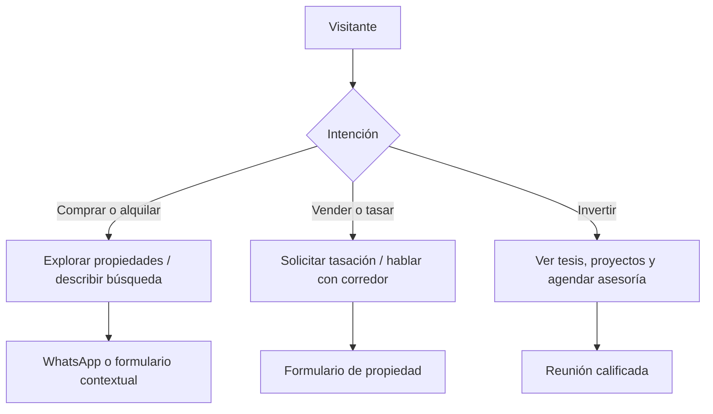
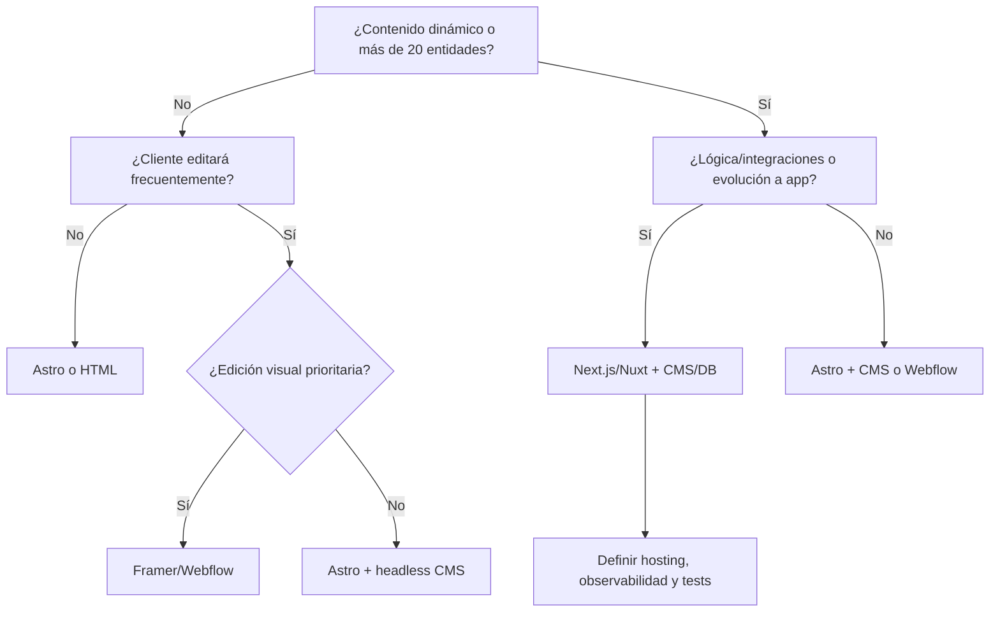
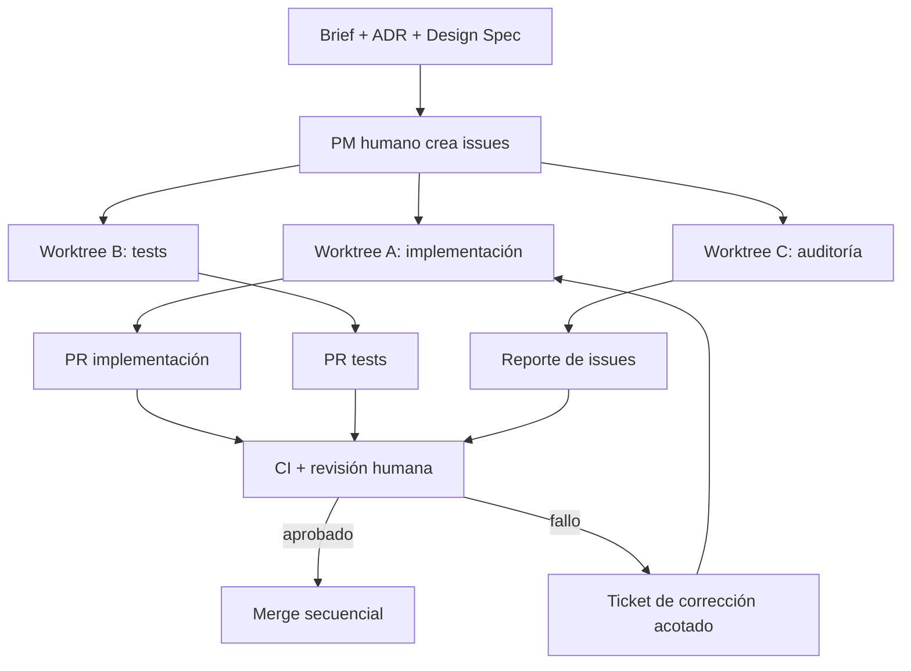
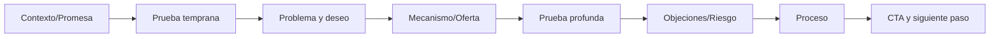

# SOP maestro para crear landing pages y sitios premium de USD 2.000+

**Versión:** 1.0  
**Fecha de investigación:** 2 de julio de 2026  
**Contexto:** agencia pequeña de desarrollo, automatización y software; foco inicial en inmobiliarias y negocios de ticket alto.  
**Uso previsto:** documento operativo para dirección, diseño, desarrollo, QA y delegación asistida por IA.

> Este documento convierte el alcance solicitado en un sistema ejecutable. No trata “premium” como un estilo visual, sino como una combinación de estrategia, diferenciación, contenido, dirección artística, conversión, ingeniería, rendimiento, accesibilidad y control de calidad.

## Suposiciones realizadas

1. El equipo inicial tiene entre 2 y 4 personas y puede concentrar varios roles en una misma persona.
2. El mercado de partida es Argentina, con posibilidad de vender en USD y atender clientes internacionales.
3. El primer vertical es inmobiliario, pero el sistema debe servir para otros servicios de alto valor.
4. “Landing” se utiliza como término comercial amplio; la Fase 0 debe corregir el formato cuando el cliente necesita un sitio institucional, portal, ecommerce o aplicación.
5. Los rangos de precio y horas incluidos son **modelos de planificación internos**, no datos universales de mercado.
6. Los presupuestos no incluyen pauta, producción fotográfica, video, modelado 3D, traducciones, licencias premium ni carga masiva de contenido salvo que se indique.
7. El cliente debe aprobar estrategia, arquitectura, copy y dirección visual mediante hitos; no se trabaja con revisiones ilimitadas.
8. No se dispone de analítica privada de los sitios estudiados. Toda evaluación de conversión externa es una **inferencia profesional**, no una afirmación sobre sus resultados reales.
9. Las observaciones visuales se obtuvieron de sitios activos, galerías de premios y material público. Algunos sitios aplican protección anti-bot; antes de usar una referencia en un proyecto concreto debe revisarse nuevamente en navegador y móvil real.
10. Claude Design se considera una herramienta de exploración y handoff anunciada por Anthropic en abril de 2026; su disponibilidad y capacidades pueden variar por cuenta o región [S42].
11. Este documento no reemplaza asesoramiento jurídico. Privacidad, matrícula profesional, publicidad sanitaria, defensa del consumidor y términos contractuales deben validarse según jurisdicción.
12. La guía se diseñó para mantenerse vigente aunque cambien los modelos de IA: las decisiones humanas, los entregables y los criterios de aprobación son independientes de una marca concreta.

---

# 1. Resumen ejecutivo

## La tesis

Una landing de USD 2.000 o más no se justifica por “verse cara”, usar fondos negros, tener scroll suave o incluir Three.js. Se justifica cuando reduce incertidumbre comercial, presenta una propuesta específica, crea una experiencia coherente con la marca, convierte tráfico cualificado, funciona bien en móvil y queda técnicamente preparada para medir, mantener y mejorar.

## El sistema operativo

El proceso se divide en 21 fases con puertas de calidad. Las fases críticas no pueden saltarse:


### Puertas obligatorias

| Gate | Para avanzar se exige | Bloquea |
|---|---|---|
| G0 Alcance | formato correcto, objetivo, presupuesto, responsables y exclusiones | onboarding |
| G1 Estrategia | segmento, oferta, conversión primaria, mensaje y objeciones | concepto |
| G2 Concepto | 3 direcciones comparadas y una seleccionada con fundamento | diseño |
| G3 Contenido | arquitectura y copy aprobados; activos reales identificados | alta fidelidad |
| G4 Diseño | desktop + móvil, estados y sistema visual consistentes | desarrollo |
| G5 Build | implementación fiel, responsive y sin deuda crítica | QA final |
| G6 Lanzamiento | formularios, tracking, legal, rendimiento y accesibilidad aprobados | producción |

## Decisiones principales

- **Astro** es la recomendación por defecto para una landing editorial o institucional mayormente estática cuando el equipo domina código y prioriza rendimiento.
- **Next.js App Router** es la recomendación por defecto cuando existen propiedades dinámicas, múltiples plantillas, CMS, personalización, autenticación, integraciones o una evolución probable hacia producto. Sus páginas y layouts son Server Components por defecto, y la interactividad debe añadirse de forma deliberada [S35].
- **Framer** puede ser óptimo para prototipos y sitios de marketing pequeños con edición visual rápida; no elimina la responsabilidad sobre semántica, accesibilidad y SEO [S38–S40].
- **Webflow** es adecuado cuando la edición visual por parte del cliente y el CMS pesan más que la libertad técnica; exige disciplina para evitar clases, interacciones y estructura desordenadas [S37].
- **WordPress** sigue siendo válido cuando el ecosistema del cliente, el editor y los proveedores ya dependen de él; no debe elegirse por costumbre.
- CMS, base de datos, React Hook Form, GSAP, Three.js, mapas y buscadores avanzados son opcionales, no símbolos de calidad.

## Realidad comercial

**USD 2.000 debería tratarse como piso, no como objetivo, para una landing realmente premium.** Si el proceso incluye research, estrategia, copy, tres direcciones creativas, diseño responsive, desarrollo, tracking, SEO, QA y documentación, el proyecto debe mantenerse aproximadamente entre 55 y 85 horas o venderse por encima de USD 3.000. A USD 2.000, un proyecto de 120 horas destruye el margen aunque el resultado sea bueno.

## Resultado esperado

Un equipo que siga este SOP debe poder:

- rechazar proyectos mal definidos;
- transformar información cruda en posicionamiento y mensaje;
- crear apariencias distintas sin perder consistencia operativa;
- entregar una landing medible, accesible y rápida;
- delegar tareas a IA sin delegar dirección ni responsabilidad;
- presentar decisiones con criterio, no pedir opiniones vagas;
- proteger margen mediante gates, límites y reutilización de infraestructura.

---

# 2. Definición operativa de una landing de más de USD 2.000

## No es

- una plantilla con colores cambiados;
- un hero atractivo seguido de bloques genéricos;
- una demo de animación;
- una página larga por obligación;
- un conjunto de componentes “premium” comprados;
- un sitio que depende de la marca del framework para parecer moderno;
- un desarrollo técnicamente complejo sin impacto comercial.

## Sí es

Una solución digital acotada que cumple simultáneamente cinco contratos:

1. **Contrato comercial:** comunica a quién sirve, qué resuelve, por qué creer y qué acción realizar.
2. **Contrato de marca:** expresa una personalidad concreta, no intercambiable.
3. **Contrato de experiencia:** permite comprender, comparar, confiar y actuar sin fricción.
4. **Contrato técnico:** carga rápido, funciona en dispositivos reales, es accesible, segura y mantenible.
5. **Contrato operativo:** se entrega con documentación, medición, responsabilidades y proceso de mejora.

## Condiciones mínimas para justificar USD 2.000+

| Dimensión | Condición mínima |
|---|---|
| Estrategia | brief, objetivo, segmento, propuesta de valor y arquitectura de persuasión documentados |
| Diferenciación | concepto rector propio y test de reemplazo de logo superado |
| Contenido | copy específico; ninguna cifra, reseña o caso inventado |
| Diseño | sistema visual, responsive real, dirección de imagen y estados completos |
| Desarrollo | semántica, componentes mantenibles, metadata, formularios robustos y manejo de errores |
| Conversión | CTA primario, eventos, reducción de riesgo y seguimiento de leads |
| SEO | indexación, metadata, arquitectura y schema legítimo según alcance |
| Rendimiento | objetivos de Core Web Vitals y presupuesto de activos |
| Accesibilidad | WCAG 2.2 AA como referencia; teclado y foco verificados [S27–S29] |
| QA | matriz de navegadores/dispositivos y bloqueos de lanzamiento |
| Entrega | capacitación, credenciales, documentación y período inicial de soporte |

## Ecuación de valor

```text
Valor percibido = especificidad × credibilidad × claridad × calidad de ejecución × reducción de riesgo
```

La multiplicación es deliberada: si una dimensión se aproxima a cero, el resultado completo cae. Una página muy estética con copy genérico sigue siendo débil. Una página clara pero visualmente inconsistente no transmite el nivel de cuidado que promete.

---

# 3. Hallazgos de la investigación

## Metodología

Se revisaron más de 30 sitios activos y colecciones curadas de Awwwards, CSS Design Awards, SiteInspire, Recent/Godly y One Page Love. Las galerías se utilizaron para descubrir patrones y material visual; los sitios oficiales se utilizaron para revisar arquitectura, contenido y acciones reales. Awwwards mantiene una colección específica de real estate, CSSDA una galería sectorial, SiteInspire se presenta como una curaduría diaria y One Page Love conserva capturas completas de páginas de una sola página [S01–S05].

### Límites de la investigación

- No se afirma que un patrón convierta más sin datos del negocio.
- “Visualmente premium” y “comercialmente efectivo” se evaluaron por separado.
- No se copiaron layouts; se extrajeron principios.
- Las fechas, campañas y homepages pueden cambiar después del 2 de julio de 2026.

## 12 hallazgos transversales

1. **La fotografía es parte de la propuesta**, no un relleno. Aman vende conexión con el lugar; Olson Kundig vende relación entre obra, paisaje y detalle; Rolls-Royce vende materialidad y personalización [S12, S18, S22].
2. **Los sitios de lujo reducen ruido, pero no necesariamente información.** La jerarquía es silenciosa; la arquitectura puede ser extensa.
3. **Las marcas fuertes pueden usar copy breve porque la reputación y el activo visual cargan parte del significado.** Una inmobiliaria desconocida no puede imitar esa brevedad sin añadir prueba y contexto.
4. **La capa editorial y la capa de acción conviven.** The Agency y SERHANT combinan narrativa de marca con búsqueda de propiedades; Aman combina relato con “Reserve” visible [S07, S09, S12].
5. **La navegación suele expresar el modelo de negocio.** Buy/Sell/Rent, regiones, agentes, desarrollos y servicios aparecen como decisiones de producto, no simples enlaces.
6. **La especificidad geográfica transmite autoridad.** Zonas, mercados, ciudades y proyectos concretos superan a mensajes globales vagos.
7. **Los mejores portfolios dejan que el trabajo sea la grilla.** Arquitectura e interiorismo usan proyectos, materiales y ubicaciones como sistema visual, evitando iconografía decorativa.
8. **Movimiento premium significa continuidad y ritmo, no cantidad.** Cuando se detecta reduced motion, Olson Kundig ofrece una experiencia alternativa; Snøhetta incluye modos simplificado y low-res [S17, S18].
9. **La utilidad vence al espectáculo en tareas de alta intención.** Compass pone búsqueda, mercados y servicios concretos por encima de una historia abstracta [S08].
10. **Los formularios de ticket alto califican sin parecer un interrogatorio.** Rolls-Royce separa tipos de consulta y contextualiza modelo/interés, aunque algunos flujos podrían simplificarse [S22].
11. **La autoridad surge de sistemas verificables:** proyectos, prensa, personas, procesos, credenciales, ubicaciones, datos y políticas.
12. **El lujo digital mal ejecutado se vuelve fricción:** video pesado, tipografía ilegible, scroll manipulado, navegación experimental, contraste bajo y contenido escondido.

## Patrones duraderos, tendencias y riesgos

| Categoría | Duradero | Tendencia/decisión contextual | Riesgo frecuente |
|---|---|---|---|
| Fotografía | activos propios, encuadre coherente, detalle y contexto | video cinemático, grano, tratamiento editorial | hero pesado o imágenes falsas |
| Tipografía | jerarquía, legibilidad, pares con función | serif de alto contraste, tipografía variable expresiva | clichés “luxury”, cuerpos pequeños |
| Composición | grilla, ritmo, alineación y tensión controlada | layouts asimétricos, texto enorme | romper lectura por demostrar creatividad |
| Movimiento | feedback, continuidad, revelado con propósito | scroll-linked storytelling, WebGL | mareo, retraso, consumo móvil |
| Contenido | prueba específica y lenguaje del cliente | manifiestos de marca | copy vacío o intercambiable |
| Conversión | CTA claro y reducción de riesgo | sticky CTA, calendar embed | agresividad, demasiados CTAs |
| Tecnología | HTML semántico y poco JS | RSC, view transitions, 3D | sobrearquitectura y lock-in |

---

# 4. Análisis de referencias inmobiliarias

## Matriz de 10 referencias principales

**Fecha de revisión para todas:** 2 de julio de 2026.

| Referencia | Modelo y público | Posicionamiento/concepto | Patrones transferibles | Riesgos o elementos no copiables | Fuente |
|---|---|---|---|---|---|
| The Agency | broker global de lujo; compradores, vendedores y agentes | “ventana al mejor real estate”; lujo personal y cultural | búsqueda inmediata, regiones, propiedades destacadas, magazine, prensa, desarrollo y contacto | home extensa; gran volumen de contenido; no imitar claims de autoridad sin prueba | [S07] |
| Compass | portal/broker tecnológico; mercado masivo premium | utilidad y acceso a inventario exclusivo | hero de búsqueda, ciudades, mercados, servicios para vender, agentes y desarrollos | estructura de portal excesiva para una inmobiliaria local; dependencia de datos | [S08] |
| SERHANT. | brokerage + media + educación | marca personal convertida en ecosistema mediático | claim memorable, regiones, inventario, agentes, market knowledge y servicios de marketing | tono imposible de transferir sin fundador visible y audiencia; exceso de marca personal para firmas tradicionales | [S09] |
| Aman Residences | residencias de ultra lujo; HNWI e inversores | pertenecer al mundo Aman; lugar, privacidad y servicio | relato aspiracional, destino como protagonista, fotografía editorial, CTA discreto y experiencia coherente con hospitality | baja densidad informativa no sirve a una marca desconocida; video e imágenes pueden pesar demasiado | [S10] |
| Mira Real Estate | agencia UAE orientada a compradores e inversores | exploración clara del país, ciudades y proyectos | filtros desktop/mobile, páginas de proyecto, historia, servicios y roadmap del cliente; fuerte orientación SEO | riesgo de amplitud excesiva y animación/color sin relación local | [S25] |
| Antares Barcelona | proyecto residencial singular | arquitectura como icono del skyline | una única idea visual, vistas, localización, amenidades y producto como relato | parallax/fullscreen puede ocultar información o degradar móvil; no copiar teatralidad sin activos | [S06] |
| Discovery Land Company | comunidades residenciales y resorts privados | exclusividad basada en comunidad, paisaje y estilo de vida | narrativa de pertenencia, destinos, fotografía humana + arquitectura, navegación por comunidades | exclusividad vaga sin evidencia; páginas lentas por medios | [S06] |
| Everhome Real Estate | catálogo de viviendas de lujo | modernidad limpia y foco fotográfico | limpieza, fichas legibles, jerarquía visual, responsive | “minimal luxury” genérico si no se incorpora territorio y personalidad | [S06] |
| Brightstone | desarrolladora de Toronto | calidad constructiva y reputación de developer | proyectos como columna vertebral, mensaje corporativo y prueba de ejecución | una grilla bonita no reemplaza información de inversión, disponibilidad y equipo | [S06] |
| Primland Residences | residencias dentro de un destino resort | naturaleza, propiedad y experiencia integrada | mezcla de hospitality y real estate, contexto de destino, amenities y lifestyle | puede priorizar aspiración sobre detalles de compra; alto coste de producción | [S06] |

## Lectura detallada de los patrones inmobiliarios

### Hero

Hay cuatro arquetipos válidos:

1. **Búsqueda primero:** para portales y brokers con inventario amplio. Campo por ubicación, operación y filtros.
2. **Proyecto primero:** para un desarrollo único. Imagen o video con nombre, ubicación, promesa y acción para recibir brochure/agendar visita.
3. **Asesor primero:** para agente o inmobiliaria local. Persona, zona, prueba y CTA a WhatsApp/reunión.
4. **Territorio primero:** para lujo, rural o inversión. El lugar y la tesis de inversión abren el relato.

**Regla:** no colocar un buscador vacío si hay pocas propiedades. Con menos de 20–30 unidades activas, suele ser mejor mostrar colecciones, categorías o propiedades seleccionadas y un CTA “Contame qué estás buscando”.

### Fichas y filtros

- El filtro debe reflejar cómo busca el cliente: operación, zona, tipo, dormitorios, rango, amenities o uso.
- La inmobiliaria pequeña debe evitar 12 filtros con resultados vacíos.
- La ficha debe mostrar estado, ubicación aproximada o exacta según seguridad, precio/consulta, superficie, ambientes, servicios, fotos honestas, mapa/contexto, responsable y próximo paso.
- Debe existir un identificador de propiedad para que WhatsApp y CRM conserven contexto.
- La galería nunca debe depender solo de un carrusel inaccesible.

### Captación dual

Una home inmobiliaria suele tener dos audiencias con intenciones distintas:



No mezclar los tres recorridos en un único formulario genérico.

## Cómo cambia la landing según el modelo inmobiliario

| Modelo | Conversión primaria | Contenido prioritario | Tecnología mínima | Error habitual |
|---|---|---|---|---|
| Inmobiliaria local | WhatsApp o tasación | zonas, equipo, propiedades elegidas, reseñas, matrícula, proceso | estático + JSON/CMS pequeño | imitar un portal nacional |
| Agente personal | llamada/reunión | rostro, especialidad, resultados verificables, testimonios, guía local | landing + agenda/WhatsApp | convertirlo en “marca de lujo” impersonal |
| Broker de lujo | consulta privada | curaduría, red, prensa, propiedades, discreción | CMS, búsqueda, CRM | ocultar detalles bajo estética |
| Desarrolladora | brochure/reunión | trayectoria, proyectos, avances, financiación, equipo | CMS de proyectos | no aclarar estado y riesgos |
| Portal de propiedades | búsqueda/lead por ficha | inventario, filtros, mapas, alertas | base de datos, API, búsqueda | tratarlo como landing simple |
| Proyecto individual | visita/brochure | concepto, ubicación, tipologías, amenities, planos, disponibilidad | landing editorial + CRM | usar renders como hechos terminados |
| Inversión | reunión calificada | tesis, números con fuente, riesgos, estructura y equipo | calculadoras opcionales, CRM | promesas financieras no sustentadas |
| Alquileres | consulta/reserva | disponibilidad, condiciones, ubicación, requisitos | CMS + calendario según volumen | fricción y datos desactualizados |
| Comercial | reunión | cap rate/uso/flujo/ubicación, documentación | fichas + documentos + CRM | copy residencial para decisión B2B |
| Rural | consulta especializada | hectáreas, suelos, agua, acceso, producción, mapas | mapas y documentos | imágenes bonitas sin datos productivos |

## Prioridad para una inmobiliaria pequeña de Argentina

1. **Confianza local:** nombres y fotos reales, matrícula y colegio cuando corresponda, domicilio o área de cobertura, reseñas verificables, años/proyectos reales.
2. **Velocidad móvil:** el lead llega desde Instagram, Google Maps o un cartel; debe cargar y permitir actuar en pocos segundos.
3. **WhatsApp contextual:** mensaje prellenado con propiedad, zona o intención; registrar evento antes de abrir la app.
4. **Captación de propietarios:** una página o bloque de tasación puede tener más valor económico que un catálogo pobre.
5. **Pocas propiedades, bien presentadas:** 6–12 fichas excelentes superan 80 fichas incompletas.
6. **Barrios con contenido propio:** historia, accesos, servicios, tipologías y experiencia real; no crear páginas masivas generadas con IA.
7. **Google Business Profile y consistencia NAP:** nombre, dirección/área y teléfono coherentes.
8. **Contenido honesto:** disponibilidad y precio actualizados; aclarar renders, medidas aproximadas y condiciones.
9. **Integración simple:** enviar datos a email/CRM/Sheet y asignar responsable. No construir un CRM antes de validar el proceso.
10. **Una acción primaria por campaña:** “pedir tasación”, “consultar esta propiedad” o “agendar visita”, no todas con igual peso.

## Datos estructurados inmobiliarios

- `RealEstateAgent` y `Residence` existen en Schema.org, pero **existir en Schema.org no garantiza un resultado enriquecido en Google**.
- Utilizar `LocalBusiness`/`Organization` para identidad y datos empresariales cuando corresponda; Google documenta `LocalBusiness` y `Organization` como tipos que ayudan a entender detalles de la entidad [S30–S31].
- Utilizar `Residence`, `Apartment`, `House`, `Offer` u otros tipos únicamente si describen contenido visible y real.
- No marcar reseñas propias como si fueran independientes ni crear FAQ falsa. Google exige que los datos estructurados representen el contenido visible y cumplan políticas de calidad [S32].

---

# 5. Análisis multisectorial

## 21 referencias complementarias

| Referencia | Sector | Qué hace premium la experiencia | Idea transferible | Riesgo |
|---|---|---|---|---|
| Foster + Partners | arquitectura | proyectos e imágenes dominan; discurso de innovación y sostenibilidad | organizar por obra, expertise y principio rector | portfolio demasiado institucional para estudio pequeño [S15] |
| Snøhetta | arquitectura multidisciplinar | lenguaje propio, proyectos con subtítulos conceptuales, opciones dark/simplified/low-res | accesibilidad como parte de identidad, no parche | navegación experimental y densidad [S16] |
| Olson Kundig | arquitectura | manifiesto específico, relación persona-lugar-experiencia, detalle | usar principios reales de práctica y reduced motion | grandes imágenes y movimiento pueden pesar [S17] |
| Yabu Pushelberg | interiorismo | interacción espacial, portfolio cruzado por disciplinas | el método y la cultura pueden diferenciar | orientación/mouse interactions no deben limitar móvil [S18] |
| Aman | hospitality | destino, calma, fotografía, reserva persistente | una acción clara dentro de una experiencia editorial | medios pesados y poca prueba para marca nueva [S12] |
| Six Senses | hospitality/wellness | naturaleza, bienestar, experiencias, destinos | estructurar oferta por transformación y lugar | exceso de subcategorías [S19] |
| One&Only | hospitality | resorts como mundos individuales, narrativa visual | combinar ambiente, experiencia y reserva | video/autoplay y carga [S20] |
| Habitas | hospitality | comunidad y pertenencia, no solo habitaciones | vender significado además de servicio | claims comunitarios sin evidencia [S23] |
| Porsche | automoción | producto, configuración y campañas con foco | CTA por etapa: descubrir/configurar/contactar | home cambiante y pesada [S21] |
| Bentley | automoción | artesanía, performance y personalización | detalles materiales y proceso como prueba | lenguaje grandilocuente sin especificidad [S21] |
| Rolls-Royce | automoción | bespoke, colección, modelos y consultas segmentadas | calificar por intención y producto | demasiados formularios/campos [S22] |
| The Lanby | salud concierge | modelo de atención, equipo, membership y claridad de servicio | traducir “premium” a acceso, coordinación y confianza | afirmaciones médicas y privacidad exigen revisión [S24] |
| Parsley Health | salud/telemedicina | rigor clínico, proceso y opciones de entrada presentados con claridad | explicar método, equipo, pricing y siguiente paso sin depender de estética clínica genérica | claims médicos y datos de salud requieren revisión rigurosa [S53] |
| McKinsey | consultoría | autoridad intelectual, industrias, insights y alcance global | contenido experto como prueba | imposible imitar autoridad por diseño [S24] |
| Linear | tecnología | producto coherente, copy preciso, demo visual | sistema visual conectado al comportamiento del producto | estética SaaS clonada fuera de contexto [S24] |
| Stripe | tecnología/finanzas | arquitectura de producto compleja presentada por capas | combinar promesa, casos y documentación | densidad y animaciones para negocios simples [S24] |
| Vercel | tecnología | identidad monocroma, demostraciones y ecosistema | producto/resultado visibles, no iconos decorativos | copiar blanco/negro produce clon [S24] |
| Aesop | cuidado personal | lenguaje editorial, producto, filosofía y tiendas | restricción, textura y tono consistente | cuerpos pequeños o navegación deliberadamente lenta [S24] |
| Bang & Olufsen | audio | producto como objeto, materialidad y lifestyle | dirección de detalle y sonido/espacio | asset weight [S24] |
| RIMOWA | equipaje | patrimonio, producto, reparación y campaña | longevidad, servicio y fabricación como valor | ecommerce complejo innecesario [S24] |
| Awwwards/CSSDA winners | curaduría transversal | innovación visual y técnica | detectar nuevas composiciones | premios no equivalen a conversión [S01–S02] |

## Transferencias por sector

| Sector | La landing debe probar | Conversión primaria habitual | Señal premium más efectiva |
|---|---|---|---|
| Arquitectura/interiorismo | criterio, obras, proceso y escala | solicitar reunión | fotografía de obra + pensamiento |
| Hotel/resort | experiencia, lugar, disponibilidad | reservar | dirección fotográfica + claridad operativa |
| Clínica | competencia, seguridad, proceso, equipo | consulta/reunión | humanidad, credenciales y reducción de riesgo |
| Legal/finanzas | especialización, discreción, casos permitidos | llamada calificada | precisión y autoridad, no ostentación |
| Automoción de lujo | producto, personalización y red | test drive/contacto | materialidad y configuración |
| B2B high-ticket | impacto, fit, proceso y prueba | reunión | especificidad del problema y casos |
| Marca personal | criterio, trayectoria, oferta | aplicación/reunión | voz, rostro y contenido propio |
| Tecnología consultiva | capacidades, integraciones, seguridad | demo | claridad técnica traducida a negocio |

---

# 6. Principios de diseño premium

## Definición

Diseño premium es la percepción de que cada decisión fue elegida, coordinada y ejecutada con intención. No depende de una estética única.

### Componentes

1. **Precisión:** alineaciones, recortes, estados y textos terminados.
2. **Coherencia:** los elementos obedecen una lógica reconocible.
3. **Restricción:** menos recursos, mejor utilizados.
4. **Dirección artística:** imagen, tipografía, composición y movimiento narran lo mismo.
5. **Calidad de activos:** fotografía, video, renders, planos y logos adecuados.
6. **Jerarquía:** la atención se dirige hacia lo importante.
7. **Ritmo:** alternancia de densidad, escala, silencio y acción.
8. **Credibilidad:** todo lo afirmado puede sostenerse.
9. **Velocidad:** la experiencia responde inmediatamente.
10. **Personalización:** el diseño nace del negocio, lugar, cliente y oferta.
11. **Detalle:** hover, focus, errores, carga, móvil, emails y OG son parte del diseño.
12. **Ausencia de arbitrariedad:** cada efecto tiene una razón.

## Recursos y condiciones

| Recurso | Funciona cuando | Se vuelve cliché cuando |
|---|---|---|
| Fondo negro | la fotografía, producto o identidad necesita contraste dramático | se usa para “parecer caro” sin sistema |
| Dorado | existe en materiales, patrimonio o marca | es un código genérico de lujo |
| Serif elegante | aporta voz editorial y se combina con una sans funcional | todas las inmobiliarias usan la misma fórmula |
| Video fullscreen | el movimiento explica lugar, producto o atmósfera | retrasa LCP y no añade información |
| Minimalismo | existe marca, activo fuerte y copy preciso | oculta información necesaria |
| Espacio vacío | crea jerarquía y respiración | alarga la página y reduce eficiencia móvil |
| Texto gigante | el titular es distintivo y la composición lo necesita | reemplaza concepto por escala |
| Animación compleja | expresa una relación imposible de explicar estáticamente | demuestra habilidad técnica a costa del usuario |

## Premium sin ostentación

- Una inmobiliaria barrial puede usar mapas dibujados, fotografía honesta de calles, una paleta vinculada a materiales locales y un tono experto.
- Una clínica puede parecer premium mediante claridad, privacidad, espacios reales, equipo visible y procesos bien explicados.
- Una consultora puede usar tipografía sobria, datos precisos, diagramas propios y casos profundos en lugar de efectos.
- Un estudio de arquitectura puede construir identidad con grilla, pies de foto, croquis y materialidad, sin negro ni dorado.

---

# 7. Sistema para evitar apariencia genérica de IA

## Regla de reversión

> Si reemplazamos logo, nombre y color principal y la página podría pertenecer a cualquier competidor, el diseño vuelve a estrategia/concepto. No se “arregla” agregando efectos.

## Lista de patrones prohibidos por defecto

Quedan prohibidos salvo fundamento documentado: gradiente violeta/azul arbitrario, esferas luminosas, glassmorphism, bento por moda, tres cards repetidas, hero texto/mockup, copy “transformamos tu negocio”, iconos de relleno, stock evidente, testimonios o logos falsos, contadores inventados, bordes redondeados universales, sombras idénticas, parallax generalizado, scroll hijacking, cursor sin función, texto gigante sin dirección, estética SaaS aplicada a real estate, componentes de librería sin personalización y secciones para alargar.

## Test de especificidad y antigenericidad — 40 preguntas

**Puntuación:** 2,5 puntos por “sí” con evidencia. Total 100.

### Estrategia y contenido

1. ¿El hero nombra un resultado, segmento o contexto que no sirve igual a cinco competidores?
2. ¿La propuesta se basa en evidencia obtenida del cliente o mercado?
3. ¿El copy utiliza lenguaje real de compradores/clientes?
4. ¿Existe una objeción prioritaria visible y respondida?
5. ¿La conversión primaria es inequívoca?
6. ¿Cada sección cumple una función en el recorrido?
7. ¿Se eliminaron claims no demostrables?
8. ¿Las pruebas sociales son reales y trazables?
9. ¿La geografía o especialidad aparece de forma sustantiva?
10. ¿El footer y microcopy también son específicos?

### Concepto y dirección artística

11. ¿Existe una idea rectora expresable en una frase?
12. ¿El concepto se conecta con negocio y no solo con gusto?
13. ¿Se exploraron tres direcciones realmente diferentes?
14. ¿La dirección elegida se diferencia del benchmark directo?
15. ¿Fotografía, tipografía, grilla y movimiento cuentan la misma historia?
16. ¿Hay un elemento distintivo que no es un adorno?
17. ¿La paleta proviene de marca, territorio, materiales o contenido?
18. ¿Las referencias culturales/locales son pertinentes y respetuosas?
19. ¿El sitio mantiene personalidad sin sacrificar comprensión?
20. ¿Puede describirse qué se decidió no usar y por qué?

### UI y composición

21. ¿La grilla varía con reglas y no al azar?
22. ¿Las secciones no repiten siempre la misma estructura?
23. ¿El uso de tarjetas está limitado a entidades que lo necesitan?
24. ¿Los radios, bordes y sombras responden a tokens?
25. ¿La escala tipográfica no depende solo de títulos enormes?
26. ¿El espacio negativo mejora jerarquía en móvil y escritorio?
27. ¿Los iconos comunican función en vez de decorar?
28. ¿Los componentes de terceros fueron adaptados al sistema?
29. ¿Los estados hover/focus/loading/error pertenecen a la misma identidad?
30. ¿La experiencia móvil fue compuesta, no solo apilada?

### Activos, movimiento y técnica

31. ¿Las imágenes son propias, licenciadas o claramente declaradas?
32. ¿Las imágenes generadas respetan arquitectura, ciudad y materialidad?
33. ¿El movimiento guía, explica o refuerza identidad?
34. ¿Existe variante reduced motion?
35. ¿La página sigue siendo comprensible sin animación?
36. ¿El peso de medios respeta el presupuesto?
37. ¿La interacción principal funciona con teclado y touch?
38. ¿El LCP no se sacrifica por el hero?
39. ¿Los metadatos y previews sociales también son personalizados?
40. ¿El test de reemplazo de logo da “no, no podría ser otro competidor”?

## Interpretación

| Puntuación | Estado | Acción |
|---:|---|---|
| 0–49 | inaceptable | volver a estrategia y concepto |
| 50–69 | genérico con correcciones mayores | rehacer copy, composición y activos |
| 70–84 | profesional pero no necesariamente distintivo | pulir diferenciadores y detalles |
| 85–92 | distintivo y comercialmente sólido | QA fino |
| 93–100 | excepcional | comprobar que no se sacrificó claridad/rendimiento |

### Bloqueos independientemente de la puntuación

- contenido, logos, números o testimonios inventados;
- imagen ficticia presentada como propiedad real;
- hero intercambiable;
- móvil incompleto;
- CTA principal ambiguo;
- animación que impide leer/actuar;
- contraste, teclado o formularios rotos.

---

# 8. Stack tecnológico y matrices de decisión

## Recomendación por defecto corregida

### Landing estática o editorial

**Astro + TypeScript + CSS Modules o Tailwind controlado + variables CSS + JavaScript mínimo + proveedor de formularios/serverless + analítica.** Astro está orientado a sitios de contenido y su arquitectura de islands permite cargar JavaScript solo en los componentes interactivos [S34, S36].

### Sitio dinámico, inmobiliario o con evolución a producto

**Next.js App Router + TypeScript estricto + Server Components por defecto + CSS/tokens + Motion solo donde aporte + Zod en límites de datos + CMS/DB únicamente si existe necesidad.** Next.js dispone de Metadata APIs, optimización de imágenes y convenciones para OG; no sustituyen una estrategia SEO ni un presupuesto de rendimiento [S33, S35].

### Sitio visual pequeño con edición rápida

**Framer** cuando: 1–8 páginas, contenido simple, alta prioridad de iteración visual, cliente no necesita lógica compleja y el equipo audita semántica/accesibilidad. Framer ofrece controles de metadata, tags, alt y reduced motion, pero la calidad depende de la configuración [S38–S40].

### Cliente editor y operación de marketing

**Webflow** cuando el cliente necesita editar colecciones y el equipo de marketing requiere control visual. Su CMS y herramientas de accesibilidad son útiles, con coste de dependencia del proveedor [S37].

## Evaluación del stack propuesto

| Elemento | Veredicto | Regla |
|---|---|---|
| Next.js App Router | condicional, no universal | usar por dinámica, integración o crecimiento |
| TypeScript estricto | sí | salvo prototipo descartable |
| RSC | sí cuando Next | mantener contenido y fetching en servidor; cliente solo por interacción |
| Tailwind | válido | definir tokens y evitar clases arbitrarias repetidas |
| CSS Modules | válido | ideal para dirección visual específica y encapsulación |
| Variables CSS | sí | fuente de verdad para tokens y temas |
| Motion | sí, con límite | microinteracciones, layout y reveal; usar `LazyMotion` cuando aporte [S46] |
| GSAP | excepcional | secuencias complejas/scroll; documentar y respetar reduced motion [S44–S45] |
| Zod | sí en fronteras | formularios, env, CMS/API; no validar decorativamente |
| React Hook Form | solo formularios complejos | un formulario de 4 campos no lo necesita |
| Resend/equivalente | válido | añadir dominio, SPF/DKIM/DMARC, retry/log y fallback |
| Vercel | buen default Next | evaluar coste, región, lock-in y portabilidad |
| Sanity/Payload | según edición/modelo | no crear CMS sin responsable editorial |
| Supabase | solo si hay datos/usuarios | no usar como bloc de notas caro |
| GTM + GA4 | sí si hay plan de medición | evitar duplicados y consentir según jurisdicción |
| Clarity/PostHog | condicional | privacidad, masking, volumen y propósito |
| Playwright | sí para flujos críticos | formularios, navegación, responsive, smoke |
| Vitest | condicional | lógica reusable; no testear markup trivial |
| axe | sí | automatizado + revisión manual |
| Lighthouse CI | sí en builds relevantes | umbrales realistas y móvil |
| Sentry | sitios con lógica/integración | innecesario para una página estática mínima |

## Matriz de frameworks/plataformas (1 bajo, 5 alto)

| Opción | Velocidad de entrega | Rendimiento potencial | SEO técnico | Edición cliente | Flexibilidad | Mantenimiento | Lock-in | Mejor escenario |
|---|---:|---:|---:|---:|---:|---:|---:|---|
| HTML/CSS/JS | 3 | 5 | 4 | 1 | 4 | 4 | 1 | micrositio simple y durable |
| Astro | 4 | 5 | 5 | 2–4 | 4 | 4 | 1 | marketing/content con poco JS |
| Next.js | 3 | 4 | 5 | 2–5 | 5 | 3 | 2–3 | dinámico, CMS, integraciones, producto |
| Nuxt | 3 | 4 | 5 | 2–5 | 5 | 3 | 2 | equipo Vue |
| Framer | 5 | 3–4 | 3–4 | 4 | 3 | 4 | 5 | landing visual rápida |
| Webflow | 4 | 3–4 | 4 | 5 | 3 | 4 | 5 | marketing con CMS visual |
| WordPress | 4 | 2–4 | 4 | 5 | 4 | 2–3 | 3 | ecosistema editorial/plugin existente |

## Árbol de decisión



## CMS: cuándo sí y cuándo no

**No CMS:** contenido cambia menos de una vez al mes, el equipo mantiene el repo, menos de 20 propiedades/proyectos y no hay editor responsable.

**CMS headless:** contenido estructurado, varios tipos, preview, roles, múltiples canales o crecimiento.

**CMS visual:** marketing necesita componer páginas con frecuencia y acepta límites/lock-in.

**Base de datos:** relaciones, búsqueda avanzada, usuarios, disponibilidad en tiempo real, sincronización o alto volumen. No por “profesionalismo”.

---

# 9. SOP completo de principio a fin
> Regla de control: ninguna fase crítica avanza por “sensación”. Cada gate requiere evidencia y aprobación registrada. Los tiempos son esfuerzo estimado, no calendario garantizado.

## FASE 0 — Calificación del proyecto

### Objetivo
Confirmar que el problema, el formato, el presupuesto y las expectativas son compatibles antes de vender diseño. Dependencia: ninguna. Gate G0.

### Responsable
Director de cuenta/estrategia.

### Participantes
Líder técnico y, cuando exista, director creativo.

### Inputs necesarios
Consulta inicial, sitio actual, oferta, rango presupuestario, fecha deseada, responsables y restricciones.

### Herramientas
Formulario de pre-calificación, videollamada de 20–30 min, calculadora de alcance, matriz de riesgos.

### Pasos
- Clasificar necesidad: landing, institucional, portal, ecommerce o aplicación.
- Definir resultado de negocio y acción principal esperada.
- Detectar volumen de contenido, idiomas, integraciones, CMS, propiedades y producción audiovisual.
- Comparar presupuesto, plazo y madurez del cliente con el estándar esperado.
- Listar exclusiones, dependencias del cliente y supuestos.
- Emitir decisión: aceptar, reencuadrar, dividir en fases o rechazar.

### Decisiones que debe tomar una persona
Aceptar riesgo comercial; elegir formato; fijar alcance, precio, calendario y política de revisiones.

### Tareas delegables a IA
Resumir llamada, detectar contradicciones, proponer preguntas faltantes y convertir notas en alcance preliminar.

### Entregables
Ficha de oportunidad, tipo de proyecto, rango, riesgos, exclusiones y recomendación go/no-go.

### Criterios de aprobación
Hay un problema comercial claro, un decisor, una conversión principal, recursos mínimos y presupuesto compatible.

### Definition of Done
Alcance preliminar firmado internamente; riesgos rojos tratados; no se prometieron funciones ni resultados no estimados.

### Tiempo estimado
45–120 min.

### Riesgos
Vender una landing cuando se necesita un portal; cliente sin contenido; fecha política; expectativas de “Apple” con presupuesto de plantilla.

### Errores frecuentes
Cotizar por número de secciones; aceptar revisiones ilimitadas; confundir gusto con objetivo.

### Qué no hacer
No enviar propuesta cerrada sin identificar decisor, contenido, integraciones y fecha real.

### Checklist
- [ ] Formato correcto
- [ ] Conversión primaria
- [ ] Decisor identificado
- [ ] Contenido evaluado
- [ ] Riesgos y exclusiones
- [ ] Presupuesto y plazo compatibles

### Plantilla o ejemplo
**Decisión:** GO / REENCUADRAR / NO-GO. **Problema:** … **Formato recomendado:** … **Conversión:** … **Incluye:** … **No incluye:** … **Dependencias del cliente:** … **Riesgos:** …

## FASE 1 — Onboarding y descubrimiento

### Objetivo
Obtener contexto suficiente para tomar decisiones estratégicas sin inventar. Dependencia: Gate G0 aprobado.

### Responsable
Estratega/PM.

### Participantes
Cliente decisor, ventas, operaciones, marketing, director creativo y técnico según alcance.

### Inputs necesarios
Contrato, alcance, cuestionario previo, analítica, identidad, activos, ofertas, reseñas y accesos disponibles.

### Herramientas
Tally/Typeform/Google Forms, Meet, grabación consentida, Notion/Drive, transcripción.

### Pasos
- Enviar formulario 48 h antes.
- Realizar entrevista orientada a objetivos, oferta, clientes, objeciones y proceso comercial.
- Distinguir hechos, opiniones e hipótesis.
- Recolectar activos y permisos/licencias.
- Mapear quién aprueba qué y en cuánto tiempo.
- Cerrar con resumen y vacíos pendientes.

### Decisiones que debe tomar una persona
Interpretar tensiones del negocio, priorizar segmentos y validar qué promesas son legítimas.

### Tareas delegables a IA
Transcribir, agrupar evidencia, extraer lenguaje del cliente, listar vacíos y generar minuta.

### Entregables
Brief de descubrimiento, inventario de activos, mapa de stakeholders, lista de faltantes y calendario de aprobaciones.

### Criterios de aprobación
Oferta, público, ticket, ciclo, objeciones, diferenciadores, restricciones y conversión están documentados con evidencia.

### Definition of Done
Cliente confirma la minuta; todos los activos tienen estado: disponible, producir, comprar, descartar o pendiente.

### Tiempo estimado
2–5 h incluyendo preparación y síntesis.

### Riesgos
Respuestas aspiracionales; múltiples decisores; ausencia de métricas; marca inconsistente.

### Errores frecuentes
Preguntar “qué estilo te gusta” antes de entender negocio; tratar deseos como requisitos.

### Qué no hacer
No comenzar moodboard ni copy final con vacíos críticos.

### Checklist
- [ ] Objetivo medible
- [ ] ICP y anti-ICP
- [ ] Oferta y ticket
- [ ] Ciclo y objeciones
- [ ] Pruebas reales
- [ ] Activos/licencias
- [ ] Integraciones
- [ ] Aprobadores

### Plantilla o ejemplo
**Formulario listo para copiar:** 1) ¿Qué debe ocurrir gracias al sitio? 2) ¿Cuál es la acción primaria? 3) ¿A quién no queremos atraer? 4) ¿Qué compra y por qué ahora? 5) Ticket/margen/ciclo. 6) Tres objeciones. 7) Competidores. 8) Pruebas disponibles. 9) Activos y derechos. 10) Restricciones. 11) Integraciones. 12) Métricas actuales. 13) Quién aprueba. 14) Fecha y motivo.

## FASE 2 — Investigación

### Objetivo
Sustituir preferencias aisladas por evidencia de mercado, lenguaje y contexto. Dependencia: brief confirmado.

### Responsable
Estratega de investigación.

### Participantes
CRO, SEO, director creativo y cliente como validador factual.

### Inputs necesarios
Brief, competidores, ubicación, reseñas, consultas comerciales, analytics y Search Console si existen.

### Herramientas
Google, Maps, Search Console, Keyword Planner, Trends, Ahrefs/Semrush opcional, SparkToro opcional, Similarweb orientativo, BuiltWith/Wappalyzer, PageSpeed, galerías de diseño.

### Pasos
- Construir mapa de competidores directos, sustitutos y aspiracionales.
- Revisar mensajes, ofertas, CTA, prueba, contenido, arquitectura y fricción.
- Analizar reseñas positivas/negativas y preguntas reales.
- Mapear intención de búsqueda y lenguaje local.
- Auditar técnicamente 5–10 referentes.
- Separar patrones repetidos de decisiones propias de marca.
- Documentar oportunidades no cubiertas.

### Decisiones que debe tomar una persona
Decidir qué evidencia es transferible y qué sería imitación o tendencia sin valor.

### Tareas delegables a IA
Clasificar reseñas, sintetizar patrones, comparar propuestas y producir tablas con citas; nunca afirmar datos no verificados.

### Entregables
Research board, benchmark comercial/visual/técnico, vocabulario del cliente, mapa de oportunidades y fuentes.

### Criterios de aprobación
Cada conclusión importante tiene fuente, evidencia o etiqueta de hipótesis; se estudiaron al menos 5 competidores directos y 5 referencias transversales.

### Definition of Done
Oportunidades priorizadas por impacto/confianza; no quedan conclusiones presentadas como métricas sin acceso a datos.

### Tiempo estimado
6–16 h según vertical.

### Riesgos
Copiar marcas grandes sin contexto; usar rankings como verdad; analizar solo desktop.

### Errores frecuentes
Confundir “premiado” con “conversor”; seleccionar referencias por estética personal.

### Qué no hacer
No copiar layout, copy, interacción ni identidad de un referente.

### Checklist
- [ ] Directos
- [ ] Sustitutos
- [ ] Aspiracionales
- [ ] Reseñas
- [ ] SERP/local
- [ ] Mensaje
- [ ] CTA/prueba
- [ ] Móvil
- [ ] Rendimiento
- [ ] Accesibilidad
- [ ] Fuentes

### Plantilla o ejemplo
**Ficha de competidor:** URL/fecha; segmento; promesa; acción; prueba; arquitectura; concepto; fortalezas; fricciones; móvil; rendimiento; accesibilidad; patrón transferible; qué no copiar; fuente.

## FASE 3 — Estrategia

### Objetivo
Definir qué debe comunicar, demostrar y provocar el sitio. Dependencia: investigación aprobada. Gate G1.

### Responsable
Estratega de marca/CRO.

### Participantes
Cliente decisor, copywriter, director creativo y analítica.

### Inputs necesarios
Brief, investigación, oferta, evidencia, restricciones y línea base de métricas.

### Herramientas
Value Proposition Canvas adaptado, mapa de objeciones, journey, matriz mensaje-prueba, árbol de KPI.

### Pasos
- Elegir segmento primario y contexto de llegada.
- Fijar una conversión primaria y hasta tres secundarias.
- Redactar propuesta de valor específica: para quién, qué resultado, mecanismo, prueba y diferencia.
- Ordenar objeciones por frecuencia y severidad.
- Construir arquitectura de persuasión: promesa → evidencia → mecanismo → riesgo → acción.
- Definir hipótesis y eventos medibles.

### Decisiones que debe tomar una persona
Elegir trade-offs: segmento, promesa, tono, grado de calificación y nivel de fricción.

### Tareas delegables a IA
Proponer variantes, tensionarlas contra evidencia y detectar lenguaje genérico o afirmaciones no sustentadas.

### Entregables
Brief estratégico, jerarquía de mensajes, mapa de confianza, journey, KPI e hipótesis CRO.

### Criterios de aprobación
La propuesta no sirve indistintamente a un competidor; cada promesa tiene prueba o se reformula.

### Definition of Done
Cliente aprueba segmento, oferta, promesa, CTA y restricciones; se registra decisión.

### Tiempo estimado
4–10 h.

### Riesgos
Querer hablar a todos; CTA múltiple sin jerarquía; beneficios abstractos.

### Errores frecuentes
Usar “innovación”, “excelencia” o “transformamos” como eje sin evidencia.

### Qué no hacer
No diseñar antes de resolver qué debe entender el usuario en 5–10 segundos.

### Checklist
- [ ] Segmento
- [ ] Contexto
- [ ] Conversión primaria
- [ ] Promesa específica
- [ ] Mecanismo
- [ ] Prueba
- [ ] Objeciones
- [ ] Riesgo
- [ ] KPI

### Plantilla o ejemplo
**Propuesta:** Ayudamos a [segmento concreto] a [resultado verificable] mediante [mecanismo] sin [fricción principal], respaldado por [prueba]. **No prometemos:** … **CTA:** …

## FASE 4 — Concepto creativo

### Objetivo
Crear una idea rectora que traduzca estrategia en un sistema visual propio. Dependencia: Gate G1. Gate G2.

### Responsable
Director creativo.

### Participantes
Diseñador, copywriter, fotógrafo/content lead, estratega y frontend.

### Inputs necesarios
Brief estratégico, contexto local/cultural, activos, limitaciones y referencias clasificadas.

### Herramientas
Figma/Claude Design, Milanote/Are.na, bibliotecas tipográficas con licencia, moodboard, storyboard.

### Pasos
- Definir 6–10 palabras guía y 6 prohibidas.
- Explorar territorio local, material, histórico, arquitectónico o cultural.
- Producir tres direcciones realmente distintas, no tres paletas del mismo layout.
- Para cada una definir idea, fundamento comercial, paleta, tipografía, composición, fotografía, movimiento, distintivo, riesgos y accesibilidad.
- Comparar con matriz estrategia/diferenciación/factibilidad.
- Seleccionar y registrar la dirección.

### Decisiones que debe tomar una persona
Dirección artística, selección y descarte; evaluar apropiación cultural, licencias y coherencia.

### Tareas delegables a IA
Expandir referencias, generar contraconceptos, criticar clichés y producir storyboards exploratorios; no aprobar.

### Entregables
Tres concept boards, canvas, moodboard, decisión argumentada y lista de reglas/no-reglas.

### Criterios de aprobación
Una dirección alcanza ≥80/100 en estrategia, distintividad, contenido, factibilidad y accesibilidad; ninguna depende de activos inexistentes.

### Definition of Done
Concepto elegido puede describirse en una frase y genera reglas concretas de composición, imagen, tipo y movimiento.

### Tiempo estimado
8–20 h.

### Riesgos
Confundir moodboard con concepto; concepto bello pero incompatible con contenido o móvil.

### Errores frecuentes
Tres variantes casi iguales; usar lujo = negro/dorado/serif.

### Qué no hacer
No abrir alta fidelidad sin idea rectora y sistema de restricciones.

### Checklist
- [ ] 3 direcciones
- [ ] Fundamento comercial
- [ ] Relación con público
- [ ] Activo principal
- [ ] Sistema gráfico
- [ ] Movimiento
- [ ] Riesgos
- [ ] Móvil
- [ ] Licencias

### Plantilla o ejemplo
**Concept canvas:** Nombre; idea en una frase; verdad de marca; tensión del cliente; metáfora; sistema de composición; color; tipo; foto; movimiento; firma distintiva; palabras guía/prohibidas; ventajas; riesgos; prueba de no-genericidad.

## FASE 5 — Arquitectura de información

### Objetivo
Ordenar la información según decisiones del usuario, no según organigrama del cliente. Dependencia: concepto y estrategia.

### Responsable
UX/arquitecto de información.

### Participantes
CRO, SEO, copywriter, cliente y técnico.

### Inputs necesarios
Mensajes, objeciones, inventario de contenido, keywords, journeys y modelos de datos.

### Herramientas
FigJam/Miro, sitemap, content matrix, card sorting ligero, diagramas Mermaid.

### Pasos
- Definir páginas y plantillas; separar landing publicitaria de arquitectura SEO.
- Ordenar bloques por pregunta del usuario.
- Definir navegación, anclas, CTA, footer y rutas de escape.
- Marcar contenido obligatorio, opcional, ausente y a eliminar.
- Diseñar versión móvil primero en flujos críticos.
- Determinar longitud por complejidad, objeciones, prueba y etapa de conciencia.

### Decisiones que debe tomar una persona
Priorizar y eliminar; decidir si la búsqueda, mapa o catálogo merecen una página/producto separado.

### Tareas delegables a IA
Generar alternativas de orden, detectar redundancia y comprobar cobertura de objeciones.

### Entregables
Sitemap, matriz página-objetivo-CTA, outline de landing y flujo móvil.

### Criterios de aprobación
Cada sección responde una pregunta o reduce una objeción; no hay bloques decorativos.

### Definition of Done
Arquitectura firmada; contenido faltante tiene dueño/fecha; URLs y plantillas están definidas.

### Tiempo estimado
3–8 h.

### Riesgos
Página interminable; navegación ocultando conversión; mezclar buscador complejo en landing.

### Errores frecuentes
Usar siempre hero + 3 tarjetas + logos + testimonios + FAQ.

### Qué no hacer
No fijar número estándar de secciones.

### Checklist
- [ ] Objetivo por página
- [ ] Pregunta por bloque
- [ ] CTA
- [ ] Prueba
- [ ] Orden móvil
- [ ] Footer/legal
- [ ] SEO vs ads
- [ ] Contenido faltante

### Plantilla o ejemplo
| Orden | Pregunta del usuario | Contenido | Prueba | CTA | Fuente | Estado | Móvil |
|---|---|---|---|---|---|---|---|

## FASE 6 — Copywriting

### Objetivo
Convertir estrategia y lenguaje real en copy específico, comprensible y verificable. Dependencia: arquitectura aprobada.

### Responsable
Copywriter/estratega.

### Participantes
Cliente experto, legal/compliance, CRO y SEO.

### Inputs necesarios
Voice of customer, propuesta, pruebas, objeciones, arquitectura, keywords y restricciones.

### Herramientas
Copy deck, transcripciones, reseñas, Hemingway/LanguageTool opcional, modelo conversacional como crítico.

### Pasos
- Extraer afirmaciones que solo esta empresa puede sostener.
- Redactar primero la jerarquía, luego titulares, cuerpo y microcopy.
- Usar frameworks como diagnóstico, no plantilla visible.
- Añadir prueba cerca de promesas.
- Escribir formularios, errores, éxito, vacíos y CTA.
- Revisar precisión, tono, lectura móvil, legalidad y SEO.

### Decisiones que debe tomar una persona
Garantizar verdad, voz, matiz y responsabilidad sobre promesas.

### Tareas delegables a IA
Crear variantes, reducir abstracción, detectar repeticiones y simular objeciones; no inventar estadísticas ni testimonios.

### Entregables
Copy deck completo con estado, fuente y aprobación por bloque.

### Criterios de aprobación
Toda cifra, cliente, premio, credencial y testimonio tiene fuente; el hero explica valor sin jerga.

### Definition of Done
Copy aprobado antes de diseño final; no quedan lorem ipsum ni contenidos “provisorios” críticos.

### Tiempo estimado
6–16 h.

### Riesgos
Cliente entrega texto corporativo; claims regulatorios; SEO forzado.

### Errores frecuentes
Titulares intercambiables; CTA “Conocer más” sin contexto; beneficios sin mecanismo.

### Qué no hacer
No inventar ni “redondear” resultados.

### Checklist
- [ ] Hero
- [ ] Prueba
- [ ] Beneficios
- [ ] Mecanismo
- [ ] Objeciones
- [ ] CTA
- [ ] Formularios
- [ ] Errores/éxito
- [ ] FAQ real
- [ ] Fuentes

### Plantilla o ejemplo
**Entrada del cliente:** afirmación / evidencia / quién puede aprobar / restricciones. **Reescritura:** mensaje primario / soporte / prueba / CTA / versión móvil / fuente.

## FASE 7 — Wireframe

### Objetivo
Validar jerarquía, flujo y conversión sin distraerse con estilo. Dependencia: copy y arquitectura. Gate G3 parcial.

### Responsable
UX designer.

### Participantes
CRO, copywriter, frontend y cliente decisor.

### Inputs necesarios
Outline, copy deck, modelos de contenido, CTA y requisitos responsive.

### Herramientas
Figma/FigJam/Claude Design, prototipo gris, anotaciones.

### Pasos
- Construir móvil y desktop de baja fidelidad.
- Ubicar prueba donde se produce duda, no en una galería aislada.
- Alternar densidad y ritmo; evitar patrones repetidos.
- Diseñar estados de navegación, formularios y contenido variable.
- Probar lectura sin color ni fotografía.
- Revisar con escenarios y no con gustos.

### Decisiones que debe tomar una persona
Resolver jerarquía y trade-offs de contenido; aprobar qué se elimina.

### Tareas delegables a IA
Generar contra-wireframes, detectar saltos lógicos y comprobar cobertura de CTA/objeciones.

### Entregables
Wireframes desktop/móvil, anotaciones, flujo de formularios y mapa de componentes.

### Criterios de aprobación
Comprensible en escala de grises; CTA visible sin saturación; flujo móvil completo; copy real cabe.

### Definition of Done
Wireframe aprobado y congelado salvo cambio de alcance documentado.

### Tiempo estimado
6–14 h.

### Riesgos
Diseñar con placeholder; desktop primero; ocultar complejidad en acordeones.

### Errores frecuentes
Añadir elementos visuales para compensar mala jerarquía.

### Qué no hacer
No aprobar por “se ve lindo”.

### Checklist
- [ ] Orden lógico
- [ ] Copy real
- [ ] Prueba contextual
- [ ] CTA
- [ ] Formulario
- [ ] Móvil
- [ ] Contenido largo/corto
- [ ] Estados

### Plantilla o ejemplo
**Criterio de revisión:** ¿Qué entiende? ¿Qué duda? ¿Qué evidencia recibe? ¿Qué acción puede tomar? ¿Qué ocurre si no está listo para convertir?

## FASE 8 — Sistema visual

### Objetivo
Definir reglas suficientes para consistencia sin crear un design system empresarial innecesario. Dependencia: concepto + wireframe.

### Responsable
UI/visual designer.

### Participantes
Director creativo, frontend y accesibilidad.

### Inputs necesarios
Concept board, wireframes, identidad, fotografía, contenido y restricciones técnicas.

### Herramientas
Figma variables/styles, tokens JSON/CSS, contraste, grid overlay.

### Pasos
- Definir tokens semánticos de color, tipo, espacio, radio, borde, sombra y motion.
- Construir escala fluida y contenedores.
- Definir reglas de imagen, iconos y texturas.
- Crear 8–15 componentes base y estados.
- Verificar contraste, zoom y contenido extremo.
- Documentar excepciones justificadas.

### Decisiones que debe tomar una persona
Decidir restricción, firma visual y cuándo romper el sistema.

### Tareas delegables a IA
Proponer escalas, verificar consistencia nominal y detectar tokens duplicados.

### Entregables
Style tile, tokens, componentes base, reglas de imagen y especificación responsive.

### Criterios de aprobación
El sistema reproduce la dirección con pocas reglas; contraste y estados esenciales están resueltos.

### Definition of Done
Tokens mapeables a código; no hay valores arbitrarios repetidos; licencias de fuentes/activos confirmadas.

### Tiempo estimado
8–18 h.

### Riesgos
Sobrediseño; demasiados radios/sombras; tipo editorial ilegible en móvil.

### Errores frecuentes
Crear 40 colores sin uso; copiar design system SaaS.

### Qué no hacer
No convertir cada variación en componente o token.

### Checklist
- [ ] Color semántico
- [ ] Tipo fluida
- [ ] Grid
- [ ] Spacing
- [ ] Estados
- [ ] Focus
- [ ] Imagen
- [ ] Iconos
- [ ] Motion
- [ ] Responsive
- [ ] Licencias

### Plantilla o ejemplo
```css
:root { --color-bg: ...; --color-text: ...; --space-1: ...; --radius-control: ...; --duration-fast: 160ms; --ease-standard: cubic-bezier(...); }
```

## FASE 9 — Diseño de alta fidelidad

### Objetivo
Materializar la estrategia y el concepto en todas las vistas y estados necesarios. Dependencia: Gate G3 completo. Gate G4.

### Responsable
Product/UI designer.

### Participantes
Director creativo, copy, CRO, frontend, accesibilidad y cliente en hito.

### Inputs necesarios
Wireframes, copy final, tokens, activos reales y especificaciones.

### Herramientas
Figma/Claude Design, prototipo, plugins de contraste y content check.

### Pasos
- Diseñar hero y dos secciones clave para validar dirección.
- Completar desktop y móvil en paralelo.
- Resolver navegación, formularios, cards, galerías, mapas, CTA, footer y estados.
- Diseñar loading, error, vacío, hover, focus y reduced motion cuando corresponda.
- Revisar 320/375/768/1024/1440/1920 y contenido extremo.
- Preparar handoff con medidas semánticas, no píxel por píxel aislado.

### Decisiones que debe tomar una persona
Dirección, composición, edición de contenido y aprobación de excepciones.

### Tareas delegables a IA
Variantes controladas, auditoría de captura y comparación con brief; no decidir identidad final.

### Entregables
Archivo de diseño, prototipo, especificación responsive, inventario de componentes y assets listos.

### Criterios de aprobación
Rúbrica visual/estratégica ≥85; móvil no es una versión apilada; estados críticos existen.

### Definition of Done
Diseño aprobado por objetivo, no solo gusto; assets exportables y handoff sin ambigüedades.

### Tiempo estimado
16–40 h.

### Riesgos
Diseño imposible de implementar; esconder problemas con mockups perfectos.

### Errores frecuentes
No probar texto largo; diseñar solo 1440 px; hover sin focus.

### Qué no hacer
No mostrar al cliente pantallas aisladas sin explicar recorrido y decisiones.

### Checklist
- [ ] 320
- [ ] 375
- [ ] 768
- [ ] 1024
- [ ] 1440
- [ ] 1920
- [ ] Nav
- [ ] Form
- [ ] Estados
- [ ] Focus
- [ ] Contenido extremo
- [ ] Assets

### Plantilla o ejemplo
**Anotación de componente:** propósito; variantes; reglas de ancho; comportamiento; contenido mínimo/máximo; estados; interacción; teclado; motion; fallback.

## FASE 10 — Prototipado y movimiento

### Objetivo
Definir movimiento útil, accesible y sostenible. Dependencia: diseño de alta fidelidad estable.

### Responsable
Interaction designer/frontend motion lead.

### Participantes
Director creativo, rendimiento y accesibilidad.

### Inputs necesarios
Concepto, storyboard, componentes, dispositivos objetivo y presupuesto técnico.

### Herramientas
CSS, Motion, GSAP/ScrollTrigger, View Transitions, Rive/Lottie, Three.js/WebGL solo con justificación, perfilador.

### Pasos
- Inventariar momentos donde movimiento explica relación, jerarquía o estado.
- Elegir la herramienta más simple.
- Especificar trigger, duración, easing, propiedades, interrupción, reduced motion y fallback.
- Prototipar las dos interacciones de mayor riesgo.
- Medir main thread, FPS, bundle y consumo móvil.
- Eliminar cualquier secuencia que retrase lectura o CTA.

### Decisiones que debe tomar una persona
Determinar intención y tolerancia; aceptar coste/beneficio.

### Tareas delegables a IA
Generar prototipos, alternativas CSS, checks de reduced motion y pruebas; no justificar movimiento por novedad.

### Entregables
Motion spec, prototipos, presupuesto y lista de fallbacks.

### Criterios de aprobación
Cada animación tiene propósito; reduced motion mantiene significado; gama media funciona razonablemente.

### Definition of Done
Sin scroll hijacking; contenido accesible de inmediato; listeners y timelines se limpian.

### Tiempo estimado
4–16 h más implementación.

### Riesgos
GSAP/WebGL para impresionar; mareo; CLS; consumo de batería.

### Errores frecuentes
Animar layout en vez de transform/opacity; 20 variantes de easing.

### Qué no hacer
No usar cursor personalizado, smooth scroll o parallax global sin utilidad medible.

### Checklist
- [ ] Propósito
- [ ] Herramienta mínima
- [ ] Reduced motion
- [ ] Teclado
- [ ] Main thread
- [ ] Bundle
- [ ] Fallback
- [ ] Cleanup

### Plantilla o ejemplo
| Elemento | Propósito | Trigger | Propiedades | Duración | Easing | Reduced motion | Fallback | Presupuesto |

## FASE 11 — Arquitectura técnica

### Objetivo
Elegir la solución mínima que cumpla contenido, SEO, edición, integración, rendimiento y mantenimiento. Dependencia: alcance y diseño estables.

### Responsable
Tech lead.

### Participantes
Frontend, backend/infra, SEO, analítica y cliente técnico.

### Inputs necesarios
Sitemap, modelos de datos, integraciones, frecuencia de edición, tráfico, SLA y capacidad del equipo.

### Herramientas
ADR, matriz de decisión, threat model ligero, spike técnico.

### Pasos
- Clasificar estático, contenido estructurado, dinámico o aplicación.
- Comparar Astro/Next/Nuxt/Framer/Webflow/WordPress/HTML con pesos del proyecto.
- Definir hosting, CMS/DB, formularios, email, analytics, CRM, antispam, seguridad, backup, observabilidad y tests.
- Hacer spike de riesgos: buscador, mapa, video, CMS, webhook.
- Definir presupuestos y límites de terceros.
- Registrar ADR.

### Decisiones que debe tomar una persona
Aceptar trade-offs, coste operativo, lock-in y responsabilidad de mantenimiento.

### Tareas delegables a IA
Comparar alternativas y redactar ADR; la decisión final es humana y basada en capacidades reales.

### Entregables
Diagrama, ADR, stack, servicios, modelos de datos, presupuesto técnico y plan de entornos.

### Criterios de aprobación
No hay tecnología sin necesidad; existe plan de fallo para formularios/integraciones.

### Definition of Done
Stack aprobado; credenciales/propietarios definidos; riesgos prototipados.

### Tiempo estimado
4–12 h.

### Riesgos
Sobrearquitectura; dependencia de un único proveedor; formulario sin entrega observable.

### Errores frecuentes
Elegir Next/DB/CMS por moda; instalar librerías antes de definir problema.

### Qué no hacer
No convertir landing en app distribuida.

### Checklist
- [ ] Framework
- [ ] Render
- [ ] CMS/DB
- [ ] Forms/email
- [ ] CRM
- [ ] Analytics
- [ ] Spam
- [ ] SEO
- [ ] Testing
- [ ] Security
- [ ] Backup
- [ ] Logs
- [ ] Deploy

### Plantilla o ejemplo
**ADR:** contexto; decisión; alternativas; criterios ponderados; consecuencias; costes; riesgos; rollback; fecha/owner.

## FASE 12 — Implementación frontend

### Objetivo
Construir una implementación fiel, semántica, tipada, rápida y mantenible. Dependencia: Gate G4 + arquitectura.

### Responsable
Frontend lead.

### Participantes
Diseño, QA, SEO, backend/infra.

### Inputs necesarios
Diseño, tokens, copy, assets, ADR, tickets y Definition of Done.

### Herramientas
Git, IDE/agentes, lint/format, Storybook opcional, Playwright, Vitest, axe, Lighthouse CI.

### Pasos
- Inicializar repo, estándares, env example y CI.
- Implementar shell semántico, tokens y componentes base.
- Construir por vertical slices completas, no por capas visuales aisladas.
- Mantener Server Components por defecto en Next y “use client” solo en fronteras interactivas.
- Optimizar imágenes, fuentes y terceros durante el desarrollo.
- Añadir metadata, schema, sitemap, robots y eventos.
- Crear pruebas de flujos críticos y revisión visual.

### Decisiones que debe tomar una persona
Revisión de arquitectura, fidelidad, semántica y deuda; aprobar dependencias.

### Tareas delegables a IA
Scaffolding, implementación acotada, refactor, tests y auditoría bajo tickets; cambios revisados por humano.

### Entregables
Repositorio, preview, CI, documentación, pruebas y changelog.

### Criterios de aprobación
Build limpio; flujos críticos; sin errores de consola; accesibilidad automatizada; presupuesto técnico preliminar.

### Definition of Done
PR revisado; diseño comparado; no hay secrets; rollback posible; Gate G5.

### Tiempo estimado
24–80 h según alcance.

### Riesgos
Componentes genéricos; exceso de client JS; divergencia diseño-código.

### Errores frecuentes
PR enormes; estilos mágicos; tipos `any`; duplicar contenido en componentes.

### Qué no hacer
No fusionar código generado sin entenderlo y probarlo.

### Checklist
- [ ] Semántica
- [ ] Tipos
- [ ] RSC/client
- [ ] Forms
- [ ] Errores
- [ ] Images/fonts
- [ ] Responsive
- [ ] Metadata/schema
- [ ] Tests
- [ ] CI
- [ ] Secrets
- [ ] README

### Plantilla o ejemplo
```text
src/
  app|pages/
  components/{ui,sections,forms}/
  content/
  lib/{analytics,validation,seo}/
  styles/{tokens,globals}/
  tests/
public/{images,fonts}/
```

## FASE 13 — Conversión

### Objetivo
Reducir incertidumbre y fricción para usuarios cualificados sin volver el sitio agresivo. Dependencia: estrategia; revisión continua durante diseño/build.

### Responsable
CRO lead.

### Participantes
Ventas, copy, UX, analítica y cliente.

### Inputs necesarios
Journey, objeciones, CRM, formularios, oferta, analytics y línea base.

### Herramientas
Plan de medición, GA4/PostHog, Clarity opcional, CRM, A/B testing solo con volumen suficiente.

### Pasos
- Verificar message match por fuente/campaña.
- Alinear promesa, prueba, mecanismo y CTA.
- Definir fricción intencional según calidad de lead.
- Diseñar WhatsApp, llamada, calendario y formulario como rutas coherentes.
- Especificar eventos y embudo.
- Planear investigación post-lanzamiento antes de experimentar.

### Decisiones que debe tomar una persona
Elegir calidad vs cantidad, tono comercial y criterios de calificación.

### Tareas delegables a IA
Analizar grabaciones/exportaciones anonimizadas, agrupar fricciones y proponer hipótesis; no declarar causalidad sin experimento.

### Entregables
Mapa CRO, plan de eventos, formularios, microconversiones e hipótesis priorizadas.

### Criterios de aprobación
Una acción primaria domina; secundarias no compiten; cada campo tiene propósito.

### Definition of Done
Eventos verificables, consentimiento y CRM alineados; no hay dark patterns.

### Tiempo estimado
4–10 h inicial + continuo.

### Riesgos
Medir clics como leads; WhatsApp sin contexto; calendarios sin calificación.

### Errores frecuentes
Repetir CTA en cada bloque; usar urgencia falsa; ocultar condiciones.

### Qué no hacer
No ejecutar A/B con tráfico insuficiente o múltiples variables sin hipótesis.

### Checklist
- [ ] Message match
- [ ] CTA primary
- [ ] Proof
- [ ] Risk reversal
- [ ] Form
- [ ] WhatsApp
- [ ] Calendar
- [ ] Events
- [ ] CRM
- [ ] Privacy

### Plantilla o ejemplo
**Hipótesis:** Para [segmento], cambiar [elemento] de [actual] a [variante] aumentará [métrica] porque [evidencia]. Guardrail: [calidad/errores].

## FASE 14 — SEO

### Objetivo
Hacer rastreable, comprensible y útil la experiencia según la intención; diferenciar landing de campaña y arquitectura orgánica. Dependencia: estrategia/IA; implementación conjunta.

### Responsable
SEO lead.

### Participantes
Copy, frontend, negocio local y contenido.

### Inputs necesarios
Keywords, SERP, ubicaciones, servicios, propiedades, sitemap y datos de negocio.

### Herramientas
Search Console, Keyword Planner, Trends, crawler, Rich Results Test, Schema Validator, logs opcionales.

### Pasos
- Clasificar intención y decidir si una sola landing puede responderla.
- Definir URLs, titles, descriptions, headings, canonicals e internal linking.
- Crear páginas locales/servicio/propiedad solo con valor único.
- Implementar schema elegible y fiel al contenido.
- Optimizar imágenes, OG, sitemap, robots e indexación.
- Conectar Google Business Profile y consistencia NAP donde aplique.
- Evitar páginas programáticas pobres o duplicadas.

### Decisiones que debe tomar una persona
Decidir arquitectura y calidad editorial; validar entidad/credenciales.

### Tareas delegables a IA
Clusters, briefs, metadata y auditoría; nunca publicar contenido masivo sin revisión y valor único.

### Entregables
Mapa keyword-URL, metadata, schema, linking, checklist de indexación y backlog de contenido.

### Criterios de aprobación
No hay canibalización evidente; cada URL tiene intención y valor; schema coincide con contenido visible.

### Definition of Done
Sitemap enviado, canonicals correctos, noindex intencional, OG probado y Search Console configurado.

### Tiempo estimado
6–16 h inicial.

### Riesgos
Landing publicitaria intentando rankear para 20 términos; páginas de barrios clonadas.

### Errores frecuentes
FAQ schema sin FAQ real; LocalBusiness genérico cuando existe subtipo; alt con keyword stuffing.

### Qué no hacer
No prometer posiciones ni crear cientos de páginas IA sin información original.

### Checklist
- [ ] Intent
- [ ] URL map
- [ ] Titles/H1
- [ ] Canonicals
- [ ] Internal links
- [ ] Schema
- [ ] Local
- [ ] Images
- [ ] Sitemap
- [ ] Robots
- [ ] Indexation

### Plantilla o ejemplo
| URL | Intención | Keyword primaria | Secundarias | H1 | Title | CTA | Schema | Links internos | Evidencia única |

## FASE 15 — Rendimiento

### Objetivo
Cumplir objetivos de experiencia real sin sacrificar claridad ni identidad. Dependencia: arquitectura; se controla desde diseño a producción.

### Responsable
Performance owner/frontend lead.

### Participantes
Diseño, motion, analítica, infraestructura.

### Inputs necesarios
Presupuesto, build, dispositivos/mercados, RUM y lista de terceros.

### Herramientas
PageSpeed Insights, Lighthouse, WebPageTest, DevTools, CrUX/RUM, bundle analyzer.

### Pasos
- Asignar presupuesto de JS, CSS, imágenes, video, fuentes y terceros.
- Identificar LCP y proteger su ruta crítica.
- Reducir JS cliente y trabajo de main thread.
- Optimizar imágenes responsive, AVIF/WebP y tamaños.
- Self-host/subset/preload solo fuentes críticas.
- Cargar videos con poster, pausa fuera de viewport y fallback móvil.
- Medir laboratorio y percentil 75 de campo.

### Decisiones que debe tomar una persona
Aprobar excepciones de peso con razón comercial y fallback.

### Tareas delegables a IA
Analizar bundles, sugerir imports, detectar recursos bloqueantes y crear pruebas; validar manualmente.

### Entregables
Reporte lab/field, presupuesto, lista de regresiones y acciones.

### Criterios de aprobación
Objetivos oficiales: LCP ≤2.5 s, INP ≤200 ms, CLS ≤0.1 al percentil 75 cuando haya datos [S26]. Objetivos internos: TTFB ≤0.8 s, FCP ≤1.8 s, JS inicial ≤150 KB gzip y peso inicial ≤1.5 MB en landing sin video; son presupuestos, no normas universales.

### Definition of Done
No hay regresiones críticas; RUM activo; terceros justificados; fallback de video/animación probado.

### Tiempo estimado
4–12 h + monitoreo.

### Riesgos
Hero video; fuentes múltiples; GTM descontrolado; imágenes CMS sin límites.

### Errores frecuentes
Optimizar puntuación de Lighthouse ignorando usuarios reales; precargar todo.

### Qué no hacer
No sacrificar rendimiento para una demo.

### Checklist
- [ ] LCP
- [ ] INP
- [ ] CLS
- [ ] TTFB/FCP
- [ ] JS/CSS
- [ ] Images
- [ ] Fonts
- [ ] Video
- [ ] Third parties
- [ ] Cache/CDN
- [ ] RUM

### Plantilla o ejemplo
**Budget:** HTML 50 KB; CSS 80 KB gzip; JS 150 KB gzip; imagen LCP 250 KB objetivo; fuentes 120 KB total; terceros 100 KB inicial; video no inicial. Ajustar por caso y documentar excepción.

## FASE 16 — Accesibilidad

### Objetivo
Cumplir WCAG 2.2 AA como referencia y evitar barreras reales. Dependencia: transversal desde concepto; gate previo a lanzamiento.

### Responsable
Accessibility owner.

### Participantes
Diseño, frontend, QA, contenido y video.

### Inputs necesarios
Diseño, build, componentes, videos, formularios y contenido.

### Herramientas
axe, Lighthouse, Accessibility Insights, lector de pantalla, teclado, contrast checker, zoom 200/400%.

### Pasos
- Revisar contraste, foco, orden DOM, landmarks y headings.
- Probar todos los flujos solo con teclado.
- Verificar labels, instrucciones, errores y anuncios.
- Evaluar alt, subtítulos, autoplay, carruseles, modales, menús y sliders.
- Respetar reduced motion y target size.
- Realizar prueba manual con NVDA/VoiceOver al menos en flujos críticos.

### Decisiones que debe tomar una persona
Interpretar experiencia y contenido alternativo; automatización no basta.

### Tareas delegables a IA
Generar casos, detectar patrones de código y proponer fixes; no certificar conformidad.

### Entregables
Checklist manual/automática, issues severidad/owner y evidencia de corrección.

### Criterios de aprobación
Cero barreras críticas/serias en flujos; WCAG 2.2 AA objetivo; targets táctiles consistentes con 2.5.8 o alternativa suficiente [S27–S29].

### Definition of Done
Teclado completo, focus visible, formularios recuperables, reduced motion y lector de pantalla probado.

### Tiempo estimado
5–14 h.

### Riesgos
UI visualmente sutil; sliders; menús custom; videos sin captions.

### Errores frecuentes
Confiar solo en axe; usar ARIA para reparar HTML incorrecto.

### Qué no hacer
No ocultar outline ni depender de color/hover.

### Checklist
- [ ] Contrast
- [ ] Keyboard
- [ ] Focus
- [ ] DOM/landmarks
- [ ] Headings
- [ ] Forms/errors
- [ ] Alt
- [ ] SR
- [ ] Targets
- [ ] Zoom
- [ ] Motion
- [ ] Video
- [ ] Modal/menu

### Plantilla o ejemplo
**Issue:** criterio; página/componente; pasos; impacto; severidad; evidencia; corrección; retest; owner.

## FASE 17 — QA

### Objetivo
Demostrar que el producto funciona en contenido, diseño, integración y condiciones reales. Dependencia: Gate G5.

### Responsable
QA owner independiente del autor cuando sea posible.

### Participantes
Diseño, frontend, SEO, analytics, cliente operativo.

### Inputs necesarios
Build candidato, diseño, copy, tickets, credenciales y matrices.

### Herramientas
Playwright, BrowserStack/dispositivos reales, axe, Lighthouse, email logs, validators, checklist.

### Pasos
- Congelar release candidate.
- Ejecutar pruebas funcionales, contenido, enlaces, formularios, email, WhatsApp, CRM y tracking.
- Comparar diseño-código en resoluciones objetivo.
- Probar navegadores, teclado, reduced motion, red lenta, imágenes faltantes y JS degradado cuando tenga sentido.
- Revisar SEO, legal, seguridad, 404/500, metadata y social cards.
- Clasificar P0–P3 y retest.

### Decisiones que debe tomar una persona
Juicio visual, contenido, riesgo y decisión de bloquear.

### Tareas delegables a IA
Generar casos y tests, comparar capturas y agrupar errores; no cerrar bugs sin evidencia.

### Entregables
Reporte QA, evidencias, bugs, estado, release notes y sign-off.

### Criterios de aprobación
Cero P0/P1; P2 aceptados por escrito con workaround/fecha; formularios y tracking comprobados end-to-end.

### Definition of Done
Gate G6 técnico cumplido; build identificado por commit; retests registrados.

### Tiempo estimado
8–20 h.

### Riesgos
Probar solo Chrome desktop; datos de prueba en producción; emails en spam.

### Errores frecuentes
QA al final; “funciona en mi PC”; aceptar discrepancias sin ticket.

### Qué no hacer
No lanzar con formulario, legal, tracking o móvil incompleto.

### Checklist
- [ ] Visual
- [ ] Copy
- [ ] Links
- [ ] Forms/email
- [ ] WhatsApp/CRM
- [ ] Analytics
- [ ] Responsive
- [ ] Browsers
- [ ] Perf
- [ ] A11y
- [ ] SEO
- [ ] Security
- [ ] 404/500
- [ ] Legal

### Plantilla o ejemplo
**Matriz mínima:** Chrome/Edge/Firefox desktop actuales; Safari macOS; Safari iOS; Chrome Android; 360×800, 390×844, 768×1024, 1366×768, 1440×900 y un dispositivo real de gama media.

## FASE 18 — Presentación al cliente

### Objetivo
Obtener feedback útil relacionando decisiones con estrategia, no gusto aislado. Dependencia: hitos de estrategia/wireframe/diseño o release.

### Responsable
Director de proyecto/creativo.

### Participantes
Decisores, diseño, estrategia y técnico según etapa.

### Inputs necesarios
Objetivos, concepto, prototipo, decisiones, restricciones y preguntas de feedback.

### Herramientas
Presentación, prototipo guiado, grabación, formulario de feedback.

### Pasos
- Recordar problema y criterios aprobados.
- Explicar concepto y cómo se traduce en jerarquía, imagen y movimiento.
- Recorrer escenarios desktop/móvil.
- Mostrar conversión, accesibilidad, rendimiento y estados.
- Pedir feedback clasificado: error factual, riesgo, objetivo no cumplido o preferencia.
- Cerrar decisiones, responsables y fecha.

### Decisiones que debe tomar una persona
Facilitar, defender razonadamente y saber cambiar cuando la evidencia lo exige.

### Tareas delegables a IA
Preparar narrativa, minuta y matriz de feedback; no responder al cliente sin supervisión.

### Entregables
Deck, grabación, feedback consolidado y log de decisiones.

### Criterios de aprobación
Feedback proviene de decisores; cada cambio está ligado a objetivo o se reconoce como cambio de alcance/preferencia.

### Definition of Done
Aprobación escrita o lista cerrada; no hay comentarios dispersos en WhatsApp.

### Tiempo estimado
1–2 h por hito + síntesis.

### Riesgos
Diseño por comité; cambios contradictorios; pregunta “¿te gusta?”.

### Errores frecuentes
Mostrar sin contexto; discutir píxeles antes de estrategia.

### Qué no hacer
No ejecutar comentarios contradictorios sin consolidación del decisor.

### Checklist
- [ ] Contexto
- [ ] Problema
- [ ] Estrategia
- [ ] Concepto
- [ ] Journey
- [ ] CTA
- [ ] Móvil
- [ ] A11y/perf
- [ ] Preguntas
- [ ] Decisiones

### Plantilla o ejemplo
**Solicitud:** ¿Qué objetivo creés que no se cumple? ¿Qué información es incorrecta/faltante? ¿Qué riesgo comercial detectás? ¿El comentario es requisito o preferencia? ¿Qué trade-off aceptarías?

## FASE 19 — Lanzamiento

### Objetivo
Publicar de forma controlada, reversible y observable. Dependencia: Gate G6 completo.

### Responsable
Tech lead/release manager.

### Participantes
DNS owner, cliente, analytics, SEO y QA.

### Inputs necesarios
Release candidate, dominio, DNS, env, integraciones, legal, backups y sign-off.

### Herramientas
Hosting/CDN, DNS, uptime monitor, Search Console, analytics debugger, email logs, rollback.

### Pasos
- Programar ventana y responsables.
- Verificar DNS/SSL, redirects, canonical, env y secrets.
- Desplegar y smoke test producción.
- Probar formularios, emails, CRM, consentimiento, eventos y social cards.
- Enviar sitemap y verificar robots/indexación.
- Activar uptime/error/RUM.
- Registrar versión y plan de rollback.

### Decisiones que debe tomar una persona
Go/no-go y coordinación; confirmar datos legales y dominio.

### Tareas delegables a IA
Ejecutar checklist automatizable, smoke tests y reporte; no cambiar DNS sin autorización.

### Entregables
Sitio productivo, checklist, evidencia, versión, accesos/documentación y rollback.

### Criterios de aprobación
Todos los bloqueos cerrados; producción probada desde red/dispositivo externo; leads llegan al destino.

### Definition of Done
URL estable, SSL, monitoring, Search Console, analytics, backup y entrega documentada.

### Tiempo estimado
2–6 h.

### Riesgos
DNS sin acceso; env incorrectas; doble tracking; robots noindex heredado.

### Errores frecuentes
Lanzar viernes/noche sin soporte; asumir que preview = producción.

### Qué no hacer
No cambiar múltiples sistemas sin rollback.

### Checklist
- [ ] Domain/DNS/SSL
- [ ] Redirects
- [ ] Env
- [ ] Forms/email/CRM
- [ ] Analytics
- [ ] Consent
- [ ] Sitemap/robots
- [ ] Favicons/OG
- [ ] Legal
- [ ] Backup
- [ ] Monitoring
- [ ] Rollback

### Plantilla o ejemplo
**Go/No-Go:** versión/commit; hora; responsables; blockers; smoke; analytics; lead test ID; rollback command; decisión firmada.

## FASE 20 — Optimización posterior

### Objetivo
Aprender con datos reales, corregir fallos y mejorar calidad/negocio sin rediseños impulsivos. Dependencia: lanzamiento.

### Responsable
Growth/CRO owner.

### Participantes
Cliente, ventas, analítica, SEO, frontend y contenido.

### Inputs necesarios
RUM, conversiones, CRM, Search Console, grabaciones consentidas, soporte y feedback comercial.

### Herramientas
Analytics, Clarity/PostHog, Search Console, CRM, Sentry, uptime, backlog ICE/RICE.

### Pasos
- 24 h: errores, uptime, leads, tracking, indexación y performance.
- Semana 1: fuentes, drop-offs, sesiones cualitativas, consultas y fricciones.
- Mes 1: calidad de leads, conversiones, Search Console, CWV real y contenido.
- Trimestre: hipótesis, experimentos, SEO, dependencias, seguridad y roadmap.
- Priorizar por evidencia/impacto/esfuerzo.
- Actualizar documentación y línea base.

### Decisiones que debe tomar una persona
Interpretar calidad comercial y decidir experimentos; separar correlación de causalidad.

### Tareas delegables a IA
Resumir grandes volúmenes, detectar patrones y preparar tickets; datos personales anonimizados/minimizados.

### Entregables
Reportes 24h/7d/30d/90d, backlog, experimentos y plan de mantenimiento.

### Criterios de aprobación
Datos confiables; denominadores claros; cambios ligados a hipótesis y guardrails.

### Definition of Done
Ciclo de mejora acordado, owners y mantenimiento separado comercialmente.

### Tiempo estimado
2–6 h/mes base + experimentos.

### Riesgos
Optimizar por clics; tráfico insuficiente; grabaciones sin privacidad; dependencias abandonadas.

### Errores frecuentes
Rediseñar por una sesión; declarar ganador sin muestra ni duración.

### Qué no hacer
No mezclar mantenimiento correctivo, contenido y CRO sin alcance/precio.

### Checklist
- [ ] 24h
- [ ] 7d
- [ ] 30d
- [ ] 90d
- [ ] Errors
- [ ] CWV
- [ ] Leads/quality
- [ ] Events
- [ ] Search
- [ ] Hypotheses
- [ ] Maintenance
- [ ] Dependencies

### Plantilla o ejemplo
| Hallazgo | Fuente | Segmento | Frecuencia | Impacto | Confianza | Hipótesis | Acción | Métrica | Guardrail | Owner |


---

# 10. Uso de Claude Design

> Estado a julio de 2026: Anthropic presentó Claude Design como una experiencia de creación visual dentro de Claude, con generación editable y posibilidad de llevar resultados a herramientas de diseño. Debe tratarse como una superficie de exploración que puede cambiar, no como la fuente de verdad del proyecto [S42].

## Para qué sí

- Explorar **tres direcciones conceptuales** a partir de un brief cerrado.
- Convertir palabras guía en composiciones, ritmos y sistemas gráficos alternativos.
- Probar rápidamente relación entre tipo, imagen, color, espacio y jerarquía.
- Producir storyboards, style tiles y bocetos de secciones de alto riesgo.
- Auditar una captura contra un brief: genericidad, consistencia, jerarquía y similitud involuntaria con referencias.
- Preparar un artefacto para discusión; no reemplazar Figma, QA ni dirección artística cuando el proyecto exige precisión.

## Para qué no

- No decidir estrategia, posicionamiento o claims.
- No aprobar accesibilidad, rendimiento ni factibilidad técnica.
- No producir “la landing completa” desde un prompt vago y luego justificarla retrospectivamente.
- No usar imágenes generadas como propiedades, pacientes, obras o resultados reales.
- No exportar un sistema visual sin revisar licencias, tokens, responsive y estados.

## Proceso recomendado

1. **Bloquear inputs:** brief, copy, assets, concepto, palabras prohibidas y resolución objetivo.
2. **Explorar por variable:** primero composición, luego tipo, luego tratamiento de imagen; no cambiar todo a la vez.
3. **Crear tres familias:** editorial/local, funcional/transaccional y expresiva/distintiva, adaptadas al proyecto.
4. **Criticar antes de pulir:** score de estrategia, genericidad, producción, accesibilidad y responsive.
5. **Seleccionar por reglas:** documentar qué se conserva y qué se descarta.
6. **Transferir:** convertir decisiones a tokens, componentes, especificaciones y assets con licencia.
7. **Reconstruir conscientemente:** el equipo implementa el sistema; no copia ciegamente un artefacto.

## Criterios de aprobación de una exploración

| Criterio | Pregunta | Mínimo |
|---|---|---:|
| Estrategia | ¿Representa una promesa y público concretos? | 16/20 |
| Distintividad | ¿Sobrevive al test de reemplazar logo? | 16/20 |
| Sistema | ¿Genera reglas reutilizables, no solo una pantalla? | 14/20 |
| Contenido | ¿Funciona con copy y activos reales? | 14/20 |
| Factibilidad | ¿Puede implementarse, mantener y degradar? | 14/20 |
| Total | | **74/100 para iterar; 82/100 para seleccionar** |

## Handoff mínimo desde Claude Design

- Captura y versión seleccionada.
- Principio rector en una frase.
- Reglas de composición.
- Tipografías y licencias candidatas.
- Paleta semántica preliminar.
- Tratamiento de fotografía/video.
- Interacciones propuestas con propósito.
- Riesgos y fallbacks.
- Lista explícita de elementos decorativos que **no** deben convertirse en componentes.
- Diferencias esperadas entre móvil y desktop.

# 11. Uso de Claude Code

Claude Code es adecuado para trabajar dentro del repositorio, leer contexto, ejecutar comandos, implementar tickets y revisar cambios. Su valor crece cuando el repo contiene instrucciones y tests; disminuye drásticamente cuando se le pide “mejorá el diseño” sin restricciones [S43].

## Responsabilidades recomendadas

- Implementar una sección o flujo definido.
- Crear variantes responsive a partir de una especificación.
- Refactorizar componentes con tests.
- Añadir validación, manejo de errores y estados.
- Corregir issues de accesibilidad y rendimiento reproducibles.
- Documentar arquitectura y decisiones.
- Ejecutar QA automatizado y preparar PR.

## Archivo `CLAUDE.md` mínimo

```md
# Objetivo del repositorio
Landing/sitio para [empresa]. Conversión primaria: [acción].

# Stack y comandos
- Instalar: ...
- Dev: ...
- Test: ...
- E2E: ...
- Lint/typecheck/build: ...

# Reglas no negociables
- TypeScript estricto; no `any` sin justificación.
- No añadir dependencias sin autorización.
- Server Components por defecto cuando aplique.
- No alterar copy, tokens o analytics fuera del ticket.
- Respetar semantic HTML, teclado y reduced motion.
- No usar datos, logos o testimonios ficticios.

# Diseño
- Fuente de verdad: [archivo/URL/versión].
- Tokens: [ruta].
- Breakpoints y containers: ...
- Presupuesto de rendimiento: ...

# Definition of Done
- Tests, typecheck, lint, build.
- Capturas en resoluciones objetivo.
- Sin errores de consola.
- PR pequeño con riesgos y evidencia.
```

## Contrato de tarea para Claude Code

```md
## Resultado esperado
[Una oración verificable]

## Contexto
[Por qué existe; vínculo a brief/diseño/issue]

## Archivos permitidos
- ...

## Archivos prohibidos
- ...

## Requisitos funcionales
1. ...

## Requisitos visuales/responsive
1. ...

## Accesibilidad y rendimiento
- ...

## Pruebas obligatorias
- ...

## No hacer
- No cambiar dependencias/copy/tokens/analytics.

## Entrega
- Resumen, archivos, comandos, capturas, riesgos y commit.
```

## Regla de revisión

Nunca aceptar “listo” como evidencia. Exigir diff, comandos ejecutados, resultados, capturas, supuestos y deuda residual. El revisor debe leer el código crítico, probar la interacción y comparar contra el diseño.

# 12. Uso de OpenAI Codex

Codex puede ejecutar tareas de ingeniería, trabajar en paralelo y operar con instrucciones de repositorio. Las capacidades de nube, app, worktrees y modelos cambian; el SOP utiliza el patrón estable: **issue acotado → entorno aislado → evidencia → PR → revisión humana** [S47–S48].

## Uso diferencial recomendado

- Auditorías independientes del código implementado por otro agente.
- Refactors mecánicos y migraciones pequeñas.
- Generación de tests unitarios/E2E a partir de casos definidos.
- Búsqueda de deuda técnica, imports, duplicación y client boundaries.
- Corrección paralela de issues que no tocan los mismos archivos.
- Revisión de seguridad, variables de entorno y logging.
- Comparación diseño-build con capturas cuando el entorno lo permite.

## `AGENTS.md` mínimo

```md
# Scope
Follow the ticket exactly. Do not broaden scope.

# Commands
install: ...
lint: ...
typecheck: ...
test: ...
e2e: ...
build: ...

# Architecture
[rendering, folders, data flow, forms, analytics]

# Guardrails
- No new dependencies without approval.
- Never fabricate content or credentials.
- Do not edit generated files.
- Preserve public APIs unless ticket says otherwise.
- Respect tokens, semantic HTML and reduced motion.

# Completion report
Files changed; tests; screenshots; assumptions; risks; rollback.
```

## Cuándo usar Claude Code y cuándo Codex

| Situación | Preferencia | Razón operativa |
|---|---|---|
| Implementación continua con contexto conversacional del repo | Claude Code | continuidad y navegación del proyecto |
| Auditoría independiente de una implementación | Codex | segundo par de ojos y aislamiento |
| Varias tareas pequeñas no solapadas | Codex en worktrees | paralelismo controlado |
| Exploración visual | Claude Design | superficie visual, no ingeniería final |
| Arquitectura/estrategia | modelo conversacional + humano | requiere decisiones de negocio |
| Cambio de alto riesgo | agente + revisor humano | ningún agente aprueba su propio cambio |

# 13. Flujo multiagente

## Principio operativo

**Humano dirige; agentes proponen y ejecutan; CI verifica; un revisor diferente aprueba.** La velocidad proviene de paralelizar tareas independientes, no de permitir que varios agentes editen los mismos archivos.



## Matriz RACI

| Actividad | Humano | Modelo conversacional | Claude Design | Claude Code | Codex | Automatización |
|---|---|---|---|---|---|---|
| Estrategia | **A/R** | C | I | I | I | I |
| Concepto | **A** | C | R | I | I | I |
| Copy factual | **A/R** | C | I | I | I | I |
| Wireframe | A | C | R | I | I | I |
| Implementación | A | I | C | R | R | C |
| Tests | A | C | I | R | R | R |
| QA visual | **A/R** | C | C | C | C | R |
| Accesibilidad/perf | A | C | I | R | R | R |
| Merge/lanzamiento | **A/R** | I | I | C | C | R |

A = accountable; R = responsible; C = consulted; I = informed.

## Regla de archivos y worktrees

1. Un issue declara rutas permitidas y prohibidas.
2. Un solo agente posee un archivo durante una ventana de trabajo.
3. Tareas que comparten tokens, layout raíz o analytics se serializan.
4. Cada worktree parte del mismo commit base.
5. PR pequeños: idealmente una capacidad, menos de 400 líneas netas salvo generación justificada.
6. Merge: infraestructura/tokens → componentes → secciones → páginas → tests visuales.
7. Tras cada merge, los demás worktrees rebasan y vuelven a ejecutar CI.

## Registro de decisiones

```md
# DEC-00X — [Título]
Fecha / owner / estado

## Contexto
## Opciones consideradas
## Decisión
## Por qué
## Consecuencias y deuda
## Evidencia
## Cuándo revisar
```

## Definition of Ready de un ticket

- Objetivo y usuario definidos.
- Diseño/copy/versiones vinculados.
- Archivos permitidos.
- Casos normales, extremos y error.
- Accesibilidad/performance.
- Tests y evidencia requerida.
- Dependencias desbloqueadas.

## Definition of Done de un ticket de agente

- Scope cumplido sin cambios colaterales.
- Diff revisable y commits pequeños.
- Lint, tipos, tests y build pasan.
- Capturas o salida reproducible.
- No secretos ni datos ficticios.
- Riesgos y supuestos declarados.
- Documentación actualizada.

## Rollback

- Feature flag para integraciones o elementos de alto riesgo.
- Commit reversible y migraciones backward-compatible.
- No mezclar refactor masivo con cambio funcional.
- Etiqueta de release antes del lanzamiento.
- Instrucción exacta de rollback en el PR.

# 14. Biblioteca de prompts

## Sobre común para todos los prompts

Copiar este encabezado y agregar el módulo específico:

```text
Actúa como [rol]. Trabaja únicamente con los inputs proporcionados.
Separa HECHOS, HIPÓTESIS, RECOMENDACIONES y DATOS FALTANTES.
No inventes clientes, cifras, testimonios, credenciales, funciones ni resultados.
No copies referencias. Extrae principios y explica el trade-off.
Cuando una decisión dependa del contexto, crea una matriz.
Cita la fuente o marca “sin evidencia”.
Devuelve el resultado en el formato exigido y termina con una autoauditoría.
```

## P01 — Investigar competidores

```text
ROL: investigador senior de UX, CRO, marca, SEO y frontend.
OBJETIVO: comparar [5–10] competidores para encontrar oportunidades, no para copiar.
INPUTS: sector, ubicación, ICP, oferta, URLs, fecha de revisión, objetivos.
TAREAS: analizar posicionamiento, hero, arquitectura, CTA, prueba, fricción, móvil, SEO visible, rendimiento aproximado, accesibilidad visible y concepto.
FORMATO: tabla por sitio + patrones comunes + huecos + principios transferibles + elementos no transferibles + fuentes.
APROBACIÓN: cada conclusión tiene evidencia; no se atribuyen conversiones sin analítica.
```

## P02 — Crear brief estratégico

```text
INPUTS: transcripción, formulario, reseñas, oferta, métricas y restricciones.
PRODUCE: hechos/hipótesis; ICP/anti-ICP; job-to-be-done; oferta; ciclo; objeciones; pruebas; conversión primaria/secundarias; promesa; riesgos; preguntas críticas.
INCLUYE: una propuesta de valor de una frase y tres alternativas, con evidencia y debilidad de cada una.
APROBACIÓN: ninguna promesa carece de prueba o etiqueta de hipótesis.
```

## P03 — Proponer conceptos creativos

```text
Crea exactamente 3 direcciones genuinamente distintas.
Para cada una: nombre, idea, verdad de marca, fundamento comercial, referencias culturales/locales, paleta, tipo, composición, fotografía, movimiento, firma distintiva, móvil, riesgos, accesibilidad y qué NO hacer.
No uses “lujo = negro/dorado”, bento, glassmorphism o gradiente salvo justificación.
Finaliza con matriz ponderada y recomendación no vinculante.
```

## P04 — Criticar un concepto

```text
INPUTS: concept board, brief y competidores.
EVALÚA 0–100: estrategia, diferencia, coherencia, producción, accesibilidad, móvil, credibilidad y longevidad.
EJECUTA: test de cambio de logo, test de activos reales y test de implementación.
SALIDA: fallos bloqueantes, mejoras de alto impacto, elementos a eliminar y veredicto: descartar/iterar/aprobar.
```

## P05 — Crear arquitectura de información

```text
INPUTS: ICP, intención, mensajes, objeciones, pruebas, SEO y CTA.
CREA: sitemap y orden de bloques. Para cada bloque: pregunta del usuario, objetivo, contenido, prueba, CTA, dependencia, versión móvil y razón de posición.
ELIMINA: bloques sin función. Distingue landing de campaña y páginas orgánicas.
```

## P06 — Crear wireframes

```text
Produce wireframe textual y/o visual low-fi para móvil y desktop usando copy real.
Marca jerarquía, densidad, prueba, CTA, estados, contenido extremo y comportamiento responsive.
Genera una variante conservadora y una distintiva. No añadas estilo final.
APROBACIÓN: comprensible en escala de grises y navegable sin hover.
```

## P07 — Crear copy

```text
INPUTS: voice of customer, oferta, pruebas, objeciones, tono, restricciones y arquitectura.
PRODUCE por sección: objetivo, titular, soporte, prueba, cuerpo, CTA, microcopy, versión móvil y fuente.
PROHÍBE: claims genéricos, urgencia falsa, estadísticas/testimonios inventados.
AUDITA: especificidad, claridad, credibilidad, lectura oral y sustituibilidad por competidor.
```

## P08 — Crear sistema visual

```text
A partir del concepto aprobado, define un sistema pequeño: tokens semánticos, escala tipográfica fluida, grid, spacing, color, bordes/radios, sombras, iconos, foto, motion y estados.
Entrega CSS variables/JSON de ejemplo y reglas de excepción.
No diseñes un sistema empresarial ni generes tokens sin uso.
```

## P09 — Auditar una captura

```text
Compara la captura con brief, wireframe, tokens y criterios.
Reporta: jerarquía, alineación, ritmo, densidad, tipo, contraste, imagen, CTA, genericidad, contenido, móvil potencial y deuda de detalle.
Prioriza P0–P3 y propone cambios verificables; no uses “se ve mejor” como argumento.
```

## P10 — Implementar una sección

```text
RESULTADO: implementar [sección] conforme a [diseño/version].
STACK/REPO: [datos]. ARCHIVOS PERMITIDOS: [...].
REQUISITOS: semántica, props, contenido, estados, responsive, focus, reduced motion, imágenes y analytics.
NO HACER: dependencias, copy/tokens globales o archivos fuera de scope.
PRUEBAS: [comandos/casos].
ENTREGA: diff, resumen, capturas, tests, supuestos, riesgos y rollback.
```

## P11 — Refactorizar componentes

```text
OBJETIVO medible: [duplicación/API/bundle]. Mantén comportamiento y apariencia.
Primero describe invariantes y plan; luego cambia en commits separados.
Añade/actualiza tests antes de modificar cuando sea viable.
No crear abstracciones con una sola implementación ni “mega-componentes”.
```

## P12 — Crear responsive

```text
INPUTS: desktop, móvil, contenido extremo y tokens.
Define comportamiento por componente usando contenido y container queries cuando aporten.
No “apiles todo”. Decide reordenamiento, ocultamiento legítimo, recorte/art direction, navegación, target size y densidad.
Entrega matriz 320/375/768/1024/1440/1920 + capturas.
```

## P13 — Mejorar accesibilidad

```text
Audita contra WCAG 2.2 AA. Combina herramienta + razonamiento manual.
Revisa teclado, focus, DOM, landmarks, headings, forms/errors, alt, lector, targets, zoom, motion, video, menus/modals/sliders.
Para cada issue: criterio, impacto, reproducción, corrección mínima, test y riesgo de regresión.
No “arregles” HTML con ARIA innecesaria.
```

## P14 — Mejorar rendimiento

```text
INPUTS: Lighthouse/WebPageTest/RUM, bundle y presupuesto.
Identifica LCP, long tasks, CLS sources, recursos bloqueantes, JS cliente, imágenes, fuentes, video y terceros.
Ordena por impacto/esfuerzo/confianza. Propón cambios con métrica esperada como hipótesis, no garantía.
Protege diseño y accesibilidad; documenta excepciones.
```

## P15 — Revisar SEO

```text
Audita intención, arquitectura, titles, descriptions, headings, URLs, canonicals, internal linking, images, schema, OG, sitemap, robots, indexación, local y duplicación.
Distingue defectos técnicos de oportunidades editoriales.
No recomendar FAQ/schema/páginas masivas sin contenido visible y único.
```

## P16 — Crear tests

```text
A partir de requisitos, crea matriz: happy path, validación, error de red, doble submit, teclado, responsive, analytics y recuperación.
Implementa solo tests valiosos y estables. Usa roles/labels, no selectores frágiles.
Entrega comandos, cobertura funcional, limitaciones y datos de prueba.
```

## P17 — Ejecutar QA

```text
Ejecuta el checklist sobre el commit [hash]. No corrijas mientras auditas.
Devuelve issues P0–P3 con pasos, esperado/actual, entorno, evidencia y componente probable.
Cubre contenido, links, forms/email/CRM, analytics, responsive, browsers, performance, accessibility, SEO, security y legal visible.
```

## P18 — Detectar apariencia genérica

```text
Aplica el test de 40 preguntas y el cambio de logo.
Detecta patrones IA/SaaS, copy sustituible, componentes sin personalizar, imágenes incoherentes y mezcla de estilos.
Devuelve puntuación, cinco evidencias, tres cambios estructurales y qué conservar.
No propongas simplemente más animación o color.
```

## P19 — Comparar diseño y desarrollo

```text
INPUTS: capturas mismas resoluciones, diseño, tokens y spec.
Compara por regiones: geometría, tipo, espaciado, color, imagen, estados y responsive.
Clasifica: desviación deliberada/documentada, bug, limitación o diseño incompleto.
Produce tickets atómicos con tolerancias, no una lista vaga.
```

## P20 — Identificar deuda técnica

```text
Audita arquitectura, client boundaries, dependencias, duplicación, tipos, estilos, accesibilidad, analytics, errores, seguridad, tests y documentación.
Clasifica deuda por riesgo comercial/técnico, coste, urgencia y dueño.
Distingue deuda real de preferencia estética o refactor sin retorno.
```

## P21 — Preparar lanzamiento

```text
Revisa release candidate contra checklist: DNS/SSL, redirects, env, forms/email/CRM, analytics/consent, Search Console, sitemap/robots, favicons/OG, legal, backups, monitoring, security, performance, accessibility y rollback.
Salida: GO / NO-GO; bloqueos; evidencia; responsables; comando/paso de rollback.
```

## Formato de revisión de cualquier respuesta de agente

```md
### Veredicto
Aprobar / Aprobar con cambios / Rechazar

### Alcance cumplido
...

### Evidencia ejecutada
...

### Desviaciones y archivos inesperados
...

### Riesgos
...

### Cambios obligatorios antes de merge
...

### Deuda aceptada con owner/fecha
...
```


---

# 15. Diseño y dirección artística

## 15.1 Sistema de dirección artística

La dirección artística no es elegir “un estilo”. Es controlar la relación entre mensaje, composición, tipografía, imagen, materialidad y movimiento para que cada decisión parezca inevitable dentro del concepto.

### Jerarquía de decisiones

1. **Verdad de marca:** qué puede afirmar y mostrar legítimamente.
2. **Tensión del público:** qué desea y qué teme.
3. **Idea rectora:** la relación que conecta ambas.
4. **Sistema:** reglas repetibles de tipo, imagen, composición y movimiento.
5. **Momentos:** lugares donde romper la regla crea énfasis.
6. **Detalle:** óptica, crops, iconos, microcopy, estados y transiciones.

## 15.2 Fotografía e imagen

### Selección

Una imagen debe cumplir al menos una función:

- demostrar un activo real;
- situar lugar, escala o contexto;
- humanizar con credibilidad;
- explicar proceso/material;
- crear deseo coherente con el comprador;
- aportar prueba o detalle que el texto no puede sustituir.

No se selecciona una foto porque “queda premium”. Se selecciona porque sostiene la narrativa.

### Narrativa recomendada

| Tipo de plano | Función | Ejemplo inmobiliario |
|---|---|---|
| Contexto | ubicar y dar significado | barrio, costa, tejido urbano |
| Arquitectura total | demostrar volumen/obra | fachada o ambiente completo |
| Humano | mostrar uso y escala | persona real habitando sin pose de stock |
| Detalle | materialidad y cuidado | piedra, carpintería, herraje, luz |
| Proceso/prueba | credibilidad | equipo, obra, visita, documentación |
| Transición | ritmo editorial | sombra, paisaje, textura, croquis |

### Reglas técnicas

- Mantener una lógica de luz: dirección, dureza y temperatura compatibles.
- Definir tratamiento: contraste, negros, saturación, piel y grano; no aplicar presets distintos por sección.
- Elegir ratios por función: 16:9/3:2 para contexto; 4:5/2:3 para retrato/editorial; 1:1 solo cuando el sistema lo necesita.
- Diseñar **art direction responsive**: crop móvil específico cuando el sujeto no sobrevive al recorte.
- Guardar máster sin pérdida; derivar AVIF/WebP y fallback según soporte.
- No agrandar archivos pequeños ni aceptar compresión visible en hero.
- Documentar autor, licencia, alcance territorial/temporal y autorización de personas/propiedades.

### IA generativa: matriz de uso

| Uso | Riesgo | Política |
|---|---:|---|
| Moodboard interno | bajo | permitido, etiquetado como exploración |
| Textura/fondo abstracto propio | medio | revisar artefactos, licencia y coherencia |
| Storyboard no publicado | bajo | permitido |
| Extensión de fondo no material | medio | documentar y revisar bordes/perspectiva |
| Imagen aspiracional declarada como conceptual | medio | aclarar si puede confundirse con realidad |
| Persona “cliente” o “profesional” ficticia | alto | no usar como prueba |
| Propiedad inexistente presentada como cartera | crítico | prohibido |
| Alterar vista, tamaño, terminación o entorno de inmueble | crítico | prohibido salvo render claramente identificado |
| Before/after sanitario o estético ficticio | crítico | prohibido |

### Checklist de artefactos de IA/edición deficiente

- [ ] Manos, dientes, orejas, reflejos y ojos naturales.
- [ ] Perspectiva y líneas arquitectónicas consistentes.
- [ ] Texto, señalética, matrículas y marcas legibles o eliminados legítimamente.
- [ ] Sombras/reflejos corresponden a las fuentes de luz.
- [ ] Materiales no se funden ni cambian sin explicación.
- [ ] Ventanas reflejan un entorno compatible.
- [ ] Ciudad, vegetación, clima y arquitectura corresponden al lugar.
- [ ] No hay repetición de personas/objetos.
- [ ] El render está identificado cuando corresponde.
- [ ] El contenido no constituye evidencia, inventario ni resultado falso.
- [ ] Licencia y consentimiento documentados.

## 15.3 Tipografía

### Selección

- Elegir primero por voz y legibilidad, luego por rareza.
- Una familia display puede aportar identidad; una familia de texto debe sostener párrafos, cifras, formularios y móvil.
- Preferir 1–2 familias, 2–4 pesos reales y un set variable cuando reduzca archivos sin introducir ejes innecesarios.
- Probar moneda, metros cuadrados, acentos, números, signos, nombres propios y texto largo.
- Ajustar ópticamente tracking y line-height por tamaño; no usar una fórmula única.

### Clichés y uso legítimo

| Recurso | Funciona cuando | Se vuelve cliché cuando |
|---|---|---|
| Serif de alto contraste | existe narrativa editorial/cultural | se añade para “lujo” sin relación |
| Sans grotesca | claridad, arquitectura, funcionalidad | copia el tono de startup genérica |
| Texto gigante | el contenido breve merece impacto | reemplaza composición y vuelve ilegible móvil |
| Itálica expresiva | acento controlado | aparece en cada titular |
| Mayúsculas espaciadas | navegación/etiquetas breves | párrafos o CTA pierden lectura |

## 15.4 Composición y ritmo

- Grilla como marco, no cárcel: romperla solo para crear jerarquía.
- Usar espacio negativo para separar ideas, no para ocultar falta de contenido.
- Alternar bloques de lectura, evidencia, imagen y acción; no repetir “texto + imagen” 8 veces.
- Diseñar el ritmo vertical con secuencias: apertura → densidad → pausa → prueba → decisión.
- Alinear ópticamente, no solo matemáticamente.
- Las esquinas, bordes, sombras y radios deben expresar materialidad o comportamiento, no decorar cada contenedor.

## 15.5 “Premium” sin ostentación

Ejemplos operativos:

- Inmobiliaria local: fotografía honesta del barrio, mapa editorial, copy específico y respuesta rápida; paleta sobria sin negro dominante.
- Clínica: luz natural, información precisa, credenciales verificables, privacidad y proceso claro; no mármol/dorado ni modelos irreales.
- B2B: demostración del mecanismo, casos y datos verificables, diagramas precisos y motion funcional; no bento ornamental.
- Arquitectura: proyectos, materiales, croquis y voz del estudio; navegación simple y tipografía disciplinada.

# 16. Copy y conversión

## 16.1 Arquitectura de persuasión para ticket alto

El usuario rara vez compra directamente en la landing. Compra el **siguiente paso seguro**: conversar, visitar, solicitar evaluación, recibir dossier o reservar una reunión. La página debe reducir cinco incertidumbres:

1. ¿Esto es para mí?
2. ¿Entienden mi situación?
3. ¿Qué ofrecen exactamente?
4. ¿Por qué creerles y por qué elegirlos?
5. ¿Qué ocurrirá si contacto?



## 16.2 Framework de hero

**No es una plantilla de redacción; es una prueba de cobertura.**

- Eyebrow opcional: categoría/ubicación/condición relevante.
- Titular: resultado, identidad o activo específico.
- Soporte: para quién, mecanismo y diferencia.
- Prueba inmediata: cartera real, credencial, reseña, dato o visual auténtico.
- CTA primario: acción + resultado o expectativa.
- Microcopy: qué pasa después, tiempo o ausencia de compromiso cuando sea verdad.

### Ejemplo inmobiliario local

**Titular:** “Encontrá una propiedad que funcione para tu vida en San Nicolás, no solo una publicación más.”  
**Soporte:** “Selección local, visitas coordinadas y acompañamiento claro para comprar, vender o alquilar sin perder tiempo entre avisos desactualizados.”  
**CTA:** “Contanos qué estás buscando por WhatsApp.”  
**Prueba a completar con datos reales:** matrícula, años, reseñas, barrios, tiempo de respuesta.

## 16.3 Mapa de objeciones

| Objeción | Tipo de respuesta | Evidencia ideal | Lugar |
|---|---|---|---|
| “No sé si tienen lo que busco” | selección/alerta personalizada | propiedades reales + formulario breve | hero/listado |
| “No confío” | autoridad y proceso | matrícula, reseñas, equipo, oficina | temprano |
| “Me van a perseguir” | expectativa de contacto | microcopy y consentimiento | CTA/form |
| “No entiendo honorarios/proceso” | transparencia gradual | pasos y FAQ real | mitad/final |
| “No sé si es buen momento” | asesoramiento/calculadora/contenido | guía o evaluación | alternativa |
| “Es demasiado caro/riesgoso” | reducción de riesgo | evidencia, proceso, condiciones | antes del CTA final |

## 16.4 Formularios

### Principios

- Cada campo debe cambiar una decisión comercial, operativa o de routing.
- El formulario inicial no debe pedir datos disponibles después salvo necesidad real.
- Etiquetas persistentes; placeholders como ejemplo, no label.
- Error cercano, específico, conservando datos.
- Estado de envío y prevención de doble submit.
- Éxito con próximo paso, plazo real y alternativa.
- Teléfono/WhatsApp con país y expectativa clara.
- Antispam progresivo: honeypot/rate limit → challenge adaptativo; no castigar primero al usuario.

### Longitud por intención

| Intención | Campos recomendados | Objetivo |
|---|---:|---|
| Consulta general | 3–5 | contacto rápido |
| Solicitud inmobiliaria | 5–8 progresivos | zona, operación, rango, plazo |
| Venta de propiedad | 5–9 | tipo, ubicación, situación, contacto |
| Reunión B2B | 4–7 + calendario opcional | empresa, problema, tamaño, urgencia |
| Aplicación/calificación | más campos, por etapas | filtrar cuando el coste comercial lo exige |

## 16.5 WhatsApp

- Prefill contextual: página, propiedad, campaña y pregunta.
- No abrir solo “Hola, quiero información”.
- Evento: click; no contabilizar como lead confirmado.
- Horarios y tiempo de respuesta reales.
- Fallback a formulario/email cuando no está disponible.
- No obligar WhatsApp si el público requiere privacidad o trazabilidad.

### Mensaje ejemplo

```text
Hola, vi [propiedad/proyecto/servicio] en [URL corta].
Me interesa [comprar/vender/invertir/alquilar].
Zona o referencia: [dato opcional].
¿Podemos coordinar el próximo paso?
```

## 16.6 Plan de medición

GA4 utiliza eventos para representar interacciones; la nomenclatura debe definirse antes de etiquetar [S49].

| Evento | Disparador | Parámetros | Conversión |
|---|---|---|---|
| `cta_click` | CTA primario | placement, label, page, campaign | no por defecto |
| `form_start` | primera interacción | form_id, page | micro |
| `form_error` | error visible | field, error_type | diagnóstico |
| `generate_lead` | confirmación de backend/CRM | form_id, lead_type | sí |
| `whatsapp_click` | apertura | placement, context | micro |
| `calendar_booked` | confirmación real/webhook | meeting_type | sí |
| `property_view` | ficha relevante | property_id, type, zone | no |
| `search_used` | búsqueda/filtros | filters_count, results | no |
| `brochure_download` | entrega real | asset_id | según calidad |

**Regla:** una pantalla de “gracias” accesible por URL no es evidencia suficiente si puede visitarse directamente. Preferir confirmación de servidor, CRM o webhook.

## 16.7 A/B testing

No hay un umbral universal de visitas. Antes de probar:

- definir métrica primaria y guardrails;
- estimar tasa base y efecto mínimo relevante;
- tener tráfico/conversiones suficientes para duración razonable;
- cambiar una hipótesis coherente, no cinco detalles;
- mantener la prueba el tiempo planificado y cubrir ciclos de negocio;
- analizar calidad de lead, no solo submit;
- no declarar causalidad a partir de heatmaps o dos grabaciones.

# 17. SEO

## 17.1 Landing publicitaria vs arquitectura orgánica

| Landing de campaña | Arquitectura SEO |
|---|---|
| un mensaje y tráfico conocido | múltiples intenciones/entradas |
| puede usar `noindex` según duplicación/estrategia | debe ser indexable y enlazada |
| copy alineado a anuncio | contenido profundo y durable |
| navegación reducida posible | navegación/contexto/internos |
| optimiza una conversión | equilibra descubrimiento y conversión |
| no necesita “meter keywords” | necesita mapa keyword–URL |

Una landing puede posicionar, pero no debe fingir cubrir un ecosistema de búsquedas con una sola URL.

## 17.2 Inmobiliarias: arquitectura recomendada

```text
/
/propiedades/
/propiedades/venta/
/propiedades/alquiler/
/propiedades/[tipo]/
/zonas/[zona]/
/propiedad/[slug-id]/
/vender-mi-propiedad/
/tasacion/
/inversiones/ (si existe oferta real)
/nosotros/
/contacto/
/recursos/[tema]/
```

### Reglas

- No crear combinaciones indexables de cada filtro sin demanda y contenido único.
- Filtros de baja utilidad: canonical/noindex según implementación; evitar espacios infinitos de URL.
- Propiedades vencidas: política 301 a equivalente, página informativa con alternativas o 410 según caso; no devolver soft 404.
- Páginas de zona: datos propios, selección, transporte, estilo de vida, mercado explicado con fuente/fecha; no párrafos reescritos por IA.
- Enlazar zona ↔ tipo ↔ propiedad ↔ servicio.
- Actualizar disponibilidad y fecha; evitar frustración por stock desactualizado.

## 17.3 Metadata

- Title: intención + diferencia + marca; evitar repetir localidad 4 veces.
- Description: propuesta/activo/acción; no es factor mágico de ranking, sí influye en comprensión del snippet.
- Un H1 que expresa tema principal; headings por estructura, no tamaño visual.
- Canonical absoluto y autocanónico salvo razón.
- OG/Twitter con imagen creada para compartir, no screenshot improvisado.
- `sitemap.xml` solo con URLs canónicas/indexables.
- `robots.txt` no se usa para eliminar del índice contenido ya indexado.

## 17.4 Datos estructurados

Google documenta `LocalBusiness` y `Organization`; el marcado debe representar contenido visible, ser exacto y cumplir políticas [S30–S32].

### Selección orientativa

- Inmobiliaria/agencia: el subtipo más específico disponible y correcto; `RealEstateAgent` en schema.org puede expresar el negocio, pero verificar elegibilidad de resultados enriquecidos y no confundir “schema válido” con “rich result garantizado”.
- Empresa: `Organization` con nombre, URL, logo y datos coherentes.
- Sucursal/local: `LocalBusiness` con dirección, teléfono, horario y geo si es real.
- Propiedad/listing: `Residence`, `Apartment`, `House` u otros tipos cuando el contenido corresponda; ofertas/precios solo si son reales y actualizados.
- FAQ: solo preguntas/respuestas visibles y legítimas; no esperar siempre resultado enriquecido.
- Breadcrumbs: cuando la jerarquía existe.

## 17.5 SEO local argentino

- Google Business Profile completo, categoría correcta, horario, teléfono, fotos y URL con UTM si se usa para medición.
- Nombre/dirección/teléfono consistentes; no insertar barrios falsos en el nombre comercial.
- Páginas locales solo donde haya presencia/servicio/evidencia.
- Reseñas: solicitar de manera ética; no filtrar solo clientes felices ni inventar.
- Matrícula, razón social, zona, equipo y canales claros.
- Contenido: preguntas reales de compradores/vendedores, documentos, procesos, gastos, plazos y particularidades locales con revisión profesional.

## 17.6 Checklist SEO técnico

- [ ] Status 200/301/404/410 correcto.
- [ ] URLs canónicas, estables y legibles.
- [ ] Hreflang solo si existen versiones equivalentes.
- [ ] Titles/descriptions únicos.
- [ ] Headings y landmarks coherentes.
- [ ] Internal links rastreables (`<a href>`).
- [ ] Imágenes con tamaño, alt y nombres útiles.
- [ ] Schema validado y fiel.
- [ ] Sitemap/robots.
- [ ] Noindex/canonical de filtros.
- [ ] JS no impide contenido crítico.
- [ ] Core Web Vitals/RUM.
- [ ] Search Console y logs de errores.
- [ ] No contenido IA masivo de bajo valor.

# 18. Rendimiento

## 18.1 Umbrales oficiales y objetivos internos

Los Core Web Vitals se evalúan en campo al percentil 75. Los umbrales “good” son LCP ≤2,5 s, INP ≤200 ms y CLS ≤0,1 [S26]. TTFB y FCP son métricas diagnósticas; los valores siguientes son **presupuestos internos recomendados**, no estándares universales.

| Métrica | Objetivo lanzamiento | Bloqueo recomendado |
|---|---:|---:|
| LCP campo p75 | ≤2,5 s | >4,0 s |
| INP campo p75 | ≤200 ms | >500 ms |
| CLS campo p75 | ≤0,1 | >0,25 |
| TTFB lab/monitor cercano | ≤0,8 s | >1,8 s sin explicación |
| FCP móvil lab | ≤1,8 s | >3,0 s |
| Lighthouse Performance móvil | ≥90 objetivo | <75 sin waiver |
| Peso inicial landing sin video | ≤1,5 MB | >3 MB |
| JS inicial gzip | ≤150 KB | >300 KB |
| CSS gzip | ≤80 KB | >150 KB |
| Fuentes iniciales | ≤120 KB | >250 KB |
| Terceros iniciales | ≤100 KB | >250 KB |

## 18.2 Presupuesto por activo

### Imágenes

- LCP hero: objetivo 150–300 KB según dimensiones/detalle.
- Cards: 40–120 KB por recurso visible.
- `srcset`/`sizes`; no enviar 2400 px a un viewport de 390 px.
- Reservar dimensiones/aspect-ratio para evitar CLS.
- `fetchpriority="high"` o prioridad solo para el recurso LCP real; no para toda la primera pantalla.
- Lazy loading debajo del fold; no lazy-load del LCP.
- AVIF cuando reduce bien; WebP/fallback por pipeline y calidad visual.

### Fuentes

La carga de fuentes puede afectar LCP y CLS; limitar familias/pesos, usar subsetting y una estrategia de `font-display` compatible con la marca [S33].

- Preferir WOFF2.
- Preload solo archivos que se usan inmediatamente.
- Ajustar fallback con métricas (`size-adjust`, ascent/descent overrides) cuando sea necesario.
- No descargar itálicas/pesos no utilizados.
- Revisar licencias de self-hosting.

### Video

- No descargar automáticamente video desktop en móvil si hay fallback.
- Poster optimizado y significativo.
- Sin audio autoplay.
- Pausar fuera de viewport y cuando la pestaña no está visible cuando sea viable.
- Comprimir por escena; varios encodes por breakpoint/conexión cuando el valor lo justifica.
- Evitar que video sea el único medio de comprender la propuesta.

### JavaScript

- Server-render/static-render contenido.
- Hidratación selectiva/islands cuando aplica.
- Evitar librerías completas por una interacción.
- Import dinámico de mapas, galerías complejas, calendarios y visualizaciones.
- Auditar GTM y widgets; un script de marketing también es producto y deuda.
- Dividir tareas largas y evitar listeners globales costosos.

## 18.3 Laboratorio y campo

| Laboratorio | Campo |
|---|---|
| reproducible, diagnóstico | usuarios, dispositivos y redes reales |
| Lighthouse/WebPageTest/DevTools | CrUX, RUM, analytics performance |
| útil antes de lanzar | útil para validar impacto real |
| no representa distribución completa | requiere volumen y tiempo |

### Cadencia

- PR: Lighthouse CI/budget sobre páginas clave.
- Release candidate: WebPageTest móvil y desktop, 3 corridas.
- 24 h: errores/TTFB/LCP preliminares.
- 28 días: CrUX si hay volumen; RUM propio antes.
- Mensual: tendencia por template, país y dispositivo.

## 18.4 Orden de optimización

1. Servidor/cache/CDN y HTML.
2. Recurso LCP y fuente crítica.
3. JS cliente/main thread/terceros.
4. CLS por dimensiones, fuentes y contenido tardío.
5. Imágenes/video debajo del fold.
6. Microoptimizaciones.

# 19. Accesibilidad

WCAG 2.2 es la referencia declarada. La conformidad no se obtiene por pasar un escáner; requiere revisión manual y contenido correcto [S27–S29].

## 19.1 Checklist manual

### Teclado y foco

- [ ] Todo interactivo es alcanzable y operable.
- [ ] Orden lógico y sin focus traps.
- [ ] Focus visible y no oculto por sticky headers.
- [ ] Skip link cuando navegación repetitiva lo justifica.
- [ ] Modales devuelven foco y cierran con Escape cuando corresponde.

### Estructura

- [ ] `lang` correcto.
- [ ] Landmarks (`header/nav/main/footer`) coherentes.
- [ ] Un H1 contextual y jerarquía sin saltos arbitrarios.
- [ ] DOM coincide con orden de lectura; CSS no reordena significado.
- [ ] Links y botones usados por semántica, no apariencia.

### Formularios

- [ ] Labels persistentes y relación programática.
- [ ] Campos requeridos/formatos explicados antes.
- [ ] Errores específicos, resumen cuando es largo y foco adecuado.
- [ ] No se pierde información tras error.
- [ ] Autocomplete tokens donde corresponden.
- [ ] Estado de envío/éxito anunciado.

### Visual y táctil

- [ ] Contraste AA en texto, controles, iconos informativos y focus.
- [ ] No depender solo del color.
- [ ] Zoom 200% y reflow hasta 400% cuando aplica.
- [ ] Targets táctiles suficientes o separación/excepción conforme a 2.5.8.
- [ ] Texto no queda sobre zonas impredecibles de imágenes.

### Multimedia y movimiento

- [ ] `prefers-reduced-motion` reduce animación no esencial.
- [ ] No hay flashes peligrosos.
- [ ] Videos con captions/transcript según contenido.
- [ ] Autoplay sin audio; controles disponibles.
- [ ] Carruseles pausables y operables; preferir no autoplay.
- [ ] Parallax/scroll effects no bloquean lectura.

## 19.2 Checklist automatizada

- [ ] axe sobre cada template y estado.
- [ ] Lighthouse Accessibility como señal, no certificado.
- [ ] ESLint/a11y rules según stack.
- [ ] Pruebas Playwright de tab order/roles/forms.
- [ ] Contraste en tokens y componentes.
- [ ] HTML validator para errores estructurales relevantes.
- [ ] Snapshot/accessibility tree en componentes críticos cuando aporta.

## 19.3 Patrones críticos

### Menú móvil

Botón con nombre/estado (`aria-expanded`), control asociado, foco visible, Escape, no ocultar contenido solo visualmente dejando tab stops activos.

### Modal

Usar `<dialog>` cuando sea apropiado o patrón probado; título, descripción, focus inicial razonable, trap controlado, cierre y retorno.

### Galería/carrusel

Una galería estática o scroll nativo suele ser mejor. Si carrusel: botones con nombre, estado/posición, teclado, swipe, pausa y contenido accesible sin depender del movimiento.

### Mapa

Nunca debe ser la única forma de acceder a ubicaciones. Proveer lista, dirección, links y filtros equivalentes.

# 20. Desarrollo frontend

## 20.1 Principios

- HTML semántico antes que componentes.
- Componente por responsabilidad, no por cada `<div>`.
- Datos/contenido separados de presentación cuando cambia o se reutiliza.
- Estado local mínimo; URL/servidor para filtros compartibles cuando corresponde.
- Fronteras cliente pequeñas.
- Tipos en límites: CMS, env, formulario, API y analytics.
- Errores diseñados y observables.
- Assets y terceros con presupuesto.

## 20.2 Estructura recomendada Next.js

```text
src/
  app/
    (marketing)/
      page.tsx
      propiedades/
      propiedad/[slug]/
    api/
    layout.tsx
    sitemap.ts
    robots.ts
    not-found.tsx
    error.tsx
  components/
    ui/
    sections/
    forms/
    property/
  content/
  lib/
    analytics/
    cms/
    env/
    seo/
    validation/
  styles/
    tokens.css
    globals.css
  types/
  tests/
public/
  fonts/
  images/
```

En Next App Router, páginas/layouts son Server Components por defecto; añadir `"use client"` solo donde se necesitan estado, efectos o APIs de navegador [S35].

## 20.3 Estructura recomendada Astro

```text
src/
  pages/
  layouts/
  components/
    ui/
    sections/
    islands/
  content/
  styles/
  lib/
public/
```

Las islands permiten mantener HTML estático y cargar JS solo en componentes interactivos [S34, S36].

## 20.4 Convenciones

### Nombres

- Componentes: sustantivo semántico (`PropertyCard`, `LeadForm`).
- Handlers: `handleSubmit`; callbacks públicos: `onSubmit`.
- Booleanos: `is`, `has`, `can`, `should`.
- No nombres visuales vagos (`BlueBox`, `Section2`).

### Props

- Interfaces pequeñas y específicas.
- No pasar 20 props cuando existe un modelo estable.
- Evitar boolean soup; usar variantes cerradas.
- No exponer detalles internos de CSS/DOM sin necesidad.

### CSS/tokens

- Tokens semánticos, no `--blue-500` como API de producto si el significado es `--color-action`.
- `clamp()` para tipo/espacio fluido con límites revisados.
- Container queries para componentes que viven en distintos contextos.
- Media queries por necesidad del contenido, no por lista de dispositivos.
- Limitar `z-index` con capas definidas.
- Evitar `!important` salvo capa de utilidad documentada.

### Imágenes/SVG/iconos

- Imágenes de contenido con alt útil; decorativas con alt vacío.
- SVG inline cuando necesita estilo/semántica; sanitizar fuentes externas.
- Iconos no sustituyen labels desconocidos.
- No cargar librería completa por tres iconos.

### Formularios

- Validación cliente para rapidez y servidor como autoridad.
- Zod u otra schema validation en límites, con mensajes humanos.
- Rate limit, honeypot y logs minimizados.
- Idempotencia cuando doble envío puede generar efectos.
- No loguear datos sensibles completos.

### Metadata/SEO

Next ofrece APIs de metadata y convenciones para OG, sitemap y robots; revisar salida final [S33]. En cualquier stack:

- canonical;
- title/description;
- OG/Twitter;
- schema serializado de forma segura;
- sitemap/robots;
- status codes;
- headings y links reales.

## 20.5 Git y PR

### Branches

- `main`: producción.
- `feat/issue-descripcion`, `fix/...`, `chore/...`.
- Worktrees para agentes paralelos.
- Nada de ramas de una semana con todo el sitio.

### Commits

- Pequeños, descriptivos y revertibles.
- No mezclar formato global, dependencia y feature.
- Ejemplo: `feat(lead-form): add server validation and CRM fallback`.

### Plantilla PR

```md
## Objetivo
## Issue/diseño
## Cambios
## Fuera de alcance
## Capturas (320/390/768/1440)
## Accesibilidad
## Rendimiento/bundle
## Tests ejecutados
## Analytics/SEO
## Riesgos y rollback
## Checklist
- [ ] lint/typecheck/test/build
- [ ] teclado/reduced motion
- [ ] contenido real
- [ ] sin secrets/datos ficticios
```

## 20.6 Seguridad mínima

- Dependencias mínimas, lockfile y actualización planificada.
- Secrets solo servidor; `.env.example` sin valores.
- Headers según hosting: CSP gradual, HSTS, nosniff, referrer policy, permissions policy.
- Sanitizar contenido HTML/CMS.
- Validar uploads y URLs externas.
- Protección CSRF donde modelo lo requiere.
- Rate limiting y límites de payload.
- Backups/export de CMS/DB y dueño de recuperación.
- Respuesta de formulario no revela internals.

# 21. Animaciones e interacciones

## 21.1 Matriz de tecnología

| Tecnología | Usar para | Evitar cuando | Coste | Accesibilidad/fallback |
|---|---|---|---:|---|
| CSS transitions | hover, focus, disclosure, pequeños estados | secuencias complejas | bajo | desactivar/reducir duración |
| CSS keyframes | loops o entrada simple | timeline coordinado mutable | bajo–medio | `prefers-reduced-motion` |
| Motion | layout, gestures, presence, secuencias React comunes | sitio casi estático con 1 efecto | medio | `useReducedMotion`, LazyMotion [S45–S46] |
| GSAP | timelines complejos, coordinación precisa | reveal básico o equipo sin mantenimiento | medio–alto | `matchMedia`, cleanup [S44] |
| ScrollTrigger | narrativa donde scroll controla relación | contenido de lectura normal | alto | experiencia lineal sin efecto |
| View Transitions | continuidad entre estados/páginas compatibles | si soporte/fallback complican sin valor | bajo–medio | navegación normal como fallback |
| Lottie | ilustración vectorial exportada | archivos enormes, controles semánticos | medio | imagen/estado estático |
| Rive | interacción state-machine propia | decoración pasiva | medio–alto | fallback y controles |
| Three.js/WebGL | producto espacial/3D con valor central | inmobiliaria local o “wow” genérico | alto | poster/video/HTML equivalente |
| Video | atmósfera o demostración auténtica | tapa copy, pesa o distrae | alto | poster, captions, mobile fallback |

## 21.2 Reglas de movimiento

- Duraciones orientativas: 120–220 ms controles; 240–480 ms transiciones; secuencias largas solo narrativas justificadas.
- Animar `transform` y `opacity` preferentemente; medir, no dogmatizar.
- El contenido crítico existe antes de animar.
- No usar delays que impidan lectura.
- Interacción interrumpible: usuario puede seguir sin esperar.
- Scroll nativo por defecto.
- Reduced motion no significa ocultar información; reemplazar movimiento por cambio inmediato o sutil.
- No animar todos los elementos que entran al viewport.

## 21.3 Especificación de animación

```yaml
id: hero-media-reveal
purpose: conectar titular con materialidad del proyecto
trigger: first paint after critical content
from: opacity 0; transform translateY(12px)
to: opacity 1; transform none
duration: 360ms
easing: standard-emphasized
stagger: none
reduced_motion: immediate opacity 1
mobile: no translate; 160ms fade
performance_budget: no additional library; no layout animation
fallback: static media
analytics: none
```

# 22. QA

## 22.1 Severidades

| Nivel | Definición | Ejemplos | Acción |
|---|---|---|---|
| P0 | pérdida/daño/ilegalidad o sitio inutilizable | dominio caído, fuga de datos | no lanzar/rollback |
| P1 | flujo primario roto o barrera crítica | formulario no entrega, móvil ilegible | bloquea |
| P2 | degradación importante con workaround | error en navegador secundario | corregir o waiver firmado |
| P3 | detalle menor | espaciado, copy no crítico | backlog |

## 22.2 Matriz funcional

- Navegación, anclas, breadcrumbs.
- Formularios: válido, inválido, red, timeout, doble submit, spam, éxito.
- Email: entrega, remitente, reply-to, formato, links, spam básico.
- WhatsApp/teléfono/calendario.
- CRM: creación, campos, source/UTM, deduplicación, error/fallback.
- Búsqueda/filtros/mapas/fichas y estados sin resultados.
- Consentimiento/cookies según implementación.
- Analytics: DebugView/network, un evento por acción, parámetros y no PII.

## 22.3 Matriz visual/responsive

| Entorno | Resolución/uso |
|---|---|
| Android gama media real | 360–412 px, red móvil |
| iPhone Safari | 375/390/430 px |
| Tablet | 768×1024 y landscape |
| Laptop | 1366×768 |
| Desktop | 1440×900 |
| Wide | 1920×1080 sin estirar contenido |
| Zoom | 200% y 400% según criterio |

Probar Chrome, Edge, Firefox y Safari actuales compatibles con el público; no prometer matrices infinitas. Revisar navegadores embebidos de Instagram/WhatsApp si son fuente relevante.

## 22.4 Contenido

- Nombres, teléfonos, matrícula, direcciones, precios, moneda, superficies, fechas.
- Propiedades/servicios activos.
- Ortografía y tono.
- Claims y fuentes.
- Links legales/sociales.
- Placeholder/lorem/datos de demo.
- Imágenes correctas, alt, créditos y derechos.

## 22.5 Condiciones de bloqueo

- Formulario o integración primaria rota.
- Datos, propiedades, testimonios o credenciales inventados.
- Tracking de conversiones falso/duplicado.
- `noindex` o canonical incorrecto en producción.
- Navegación teclado rota o contraste crítico.
- Móvil incompleto.
- PII expuesta en URL/log/analytics.
- Vulnerabilidad conocida crítica explotable.
- Rendimiento móvil en zona “poor” sin waiver y plan.
- Política/aviso legal requerido ausente o incorrecto según revisión profesional.

# 23. Lanzamiento

## 23.1 Checklist operativa

### Infraestructura

- [ ] Dominio y owner confirmados.
- [ ] DNS planificado y TTL revisado.
- [ ] SSL/HSTS.
- [ ] Producción separada de preview.
- [ ] Variables y secrets.
- [ ] Redirect map incluido.
- [ ] Backup/export y rollback.
- [ ] Uptime/error monitoring.

### Producto

- [ ] Copy y activos finales.
- [ ] Formularios, email, CRM y WhatsApp end-to-end.
- [ ] Estados 404/500/error.
- [ ] Analytics/consentimiento.
- [ ] Favicon/manifest/OG.
- [ ] Metadata/schema.
- [ ] Sitemap/robots/canonicals.
- [ ] Search Console.
- [ ] Performance/a11y/QA sign-off.
- [ ] Privacidad, términos, cookies y avisos aplicables.

### Comunicación

- [ ] Ventana y responsables.
- [ ] Stakeholders avisados.
- [ ] Congelamiento de contenido durante release.
- [ ] Canal de incidentes.
- [ ] Documento de entrega/capacitación.
- [ ] Periodo de garantía definido.

## 23.2 Datos personales en Argentina

La Ley 25.326 regula protección de datos personales; la AAIP publica obligaciones y criterios. El formulario debe informar finalidad, responsable/canal y tratamiento aplicable, además de obtener consentimiento cuando corresponda. La implementación concreta requiere revisión legal según datos, cookies, proveedores y transferencias [S51–S52].

Prácticas mínimas:

- recolectar solo datos necesarios;
- no enviar PII a analytics;
- acceso restringido al CRM;
- retención y eliminación definidas;
- masking en herramientas de sesión;
- contratos/proveedores y transferencias revisados;
- canal para derechos del titular;
- HTTPS y control de logs.

## 23.3 Runbook

```text
T-60 min: congelar, backup, verificar status providers.
T-30: deploy prod, no cambiar DNS aún si es migración.
T-20: smoke interno y leads de prueba.
T-10: DNS/redirect switch.
T+0: navegación externa, SSL, forms, analytics, robots.
T+30: uptime/logs/email/CRM.
T+2 h: Search Console, social cards, mobile real.
T+24 h: incidentes, leads, CWV/RUM preliminar.
```

# 24. Optimización

## Primeras 24 horas

- Uptime, errores JS/server y 404.
- Entrega real de formularios/CRM/email.
- Eventos duplicados o faltantes.
- DNS/SSL/redirects/indexación.
- RUM, LCP element, CLS y third-party failures.
- Feedback del equipo comercial.

## Primera semana

- Fuentes/campañas y message match.
- Tasa de inicio/éxito/error de formularios.
- Calidad y tiempo de respuesta del lead.
- Consultas de búsqueda interna/sin resultados.
- Grabaciones/heatmaps con privacidad: buscar patrones, no anécdotas. Clarity ofrece grabaciones y mapas; deben configurarse con masking y propósito claro [S50].
- Issues SEO/indexación y snippets.

## Primer mes

- Embudo por dispositivo/fuente/servicio.
- Leads cualificados y reuniones, no solo clics.
- Search Console: consultas, páginas, cobertura.
- Core Web Vitals reales/RUM.
- Contenido desactualizado.
- Hipótesis priorizadas ICE/RICE.

## Primer trimestre

- Experimentos con suficiente volumen.
- Crecimiento de arquitectura SEO donde exista demanda/evidencia.
- Dependencias, vulnerabilidades y backups.
- Revisión de oferta/copy con ventas.
- Revisión de costos de hosting, CMS, email, mapas y analítica.
- Roadmap y mantenimiento separado.

## Plantilla de reporte

```md
# Reporte [24h/7d/30d/90d]
## Salud técnica
## Rendimiento por dispositivo
## Embudo y calidad de lead
## SEO/indexación
## Hallazgos cualitativos
## Incidentes
## Hipótesis priorizadas
## Acciones/owner/fecha
## Decisiones que requiere el cliente
```


---

# 25. Modelo comercial

## 25.1 Qué justifica USD 2.000+

El precio se justifica cuando el alcance incluye suficiente **pensamiento, producción y reducción de riesgo**, no cuando se rebautiza una plantilla. Como mínimo, una oferta premium debe entregar:

- investigación y brief estratégico;
- propuesta de valor y arquitectura de persuasión;
- copy específico o dirección/revisión profunda de copy;
- concepto creativo con alternativas;
- wireframes y responsive real;
- sistema visual y dirección de imágenes;
- desarrollo personalizado y mantenible;
- formularios/integraciones observables;
- SEO técnico base y metadata/schema aplicables;
- analytics y eventos;
- accesibilidad y rendimiento con objetivos;
- QA, lanzamiento, documentación y garantía inicial.

No todos los proyectos necesitan todos los servicios. Un precio alto sin alcance, evidencia o riesgo equivalente no es “premium”: es margen sin fundamento.

## 25.2 Matriz de productos

> Rangos internos orientativos en USD para venta directa. Deben ajustarse por mercado, impuestos, complejidad, reputación, producción y capacidad. Horas = esfuerzo total del equipo; tiempo = calendario si el cliente responde a tiempo.

| Producto | Alcance | Horas | Equipo | Complejidad/riesgo | Entregables clave | Exclusiones típicas | Rango orientativo | Margen bruto objetivo* | Calendario | Revisiones |
|---|---|---:|---|---|---|---|---:|---:|---|---:|
| Landing básica | 1 página, contenido provisto, sistema existente | 20–35 | 1–2 | bajo | adaptación, build, form, SEO base, QA | estrategia/copy/foto/CMS | 700–1.400 | 45–60% | 1–2 sem | 1 ronda |
| Landing profesional | research ligero, copy editado, concepto simple, responsive | 40–70 | 2 | medio | brief, wireframe, UI, build, analytics, QA | producción audiovisual, lógica compleja | 1.400–2.500 | 45–60% | 2–4 sem | 2 hitos |
| Landing premium | research, estrategia, copy, 3 conceptos, art direction, build y CRO | 75–140 | 2–4 | medio–alto | sistema completo descrito en este SOP | portal, carga masiva, 3D/foto salvo cotización | 2.500–6.000 | 40–55% | 4–7 sem | 2 rondas por hito |
| Sitio institucional premium | 5–12 páginas/plantillas, contenido y SEO estructurado | 120–240 | 3–5 | alto | IA, copy, diseño, CMS opcional, páginas, QA | portal/ecommerce/app | 5.000–12.000 | 40–55% | 6–12 sem | 2 rondas/hito |
| Portal inmobiliario MVP | listado, fichas, filtros, CMS/DB, leads, mapas opcionales | 250–600 | 3–6 | alto | modelos, admin/CMS, sync, búsqueda, SEO templates, observabilidad | integraciones de terceros no definidas, app móvil | 10.000–30.000+ | 35–50% | 10–24 sem | por sprint/aceptación |
| Experiencia personalizada | 3D/WebGL, narrativa avanzada, producción de medios | 180–600+ | 4–8 | muy alto | concepto, prototipos, assets, ingeniería, performance fallbacks | producción/licencias salvo contrato | 12.000–50.000+ | 35–50% | 8–24 sem | hitos cerrados |

\* Margen bruto antes de estructura, ventas, impuestos y costo de oportunidad. No es beneficio neto.

## 25.3 Condiciones reales para vender una landing premium

Debe cumplirse la mayoría:

- impacto comercial potencial suficiente;
- decisor y proceso de ventas identificados;
- necesidad de diferenciación real;
- contenido/activos de calidad o presupuesto para producirlos;
- personalización visual y de mensaje;
- riesgo técnico/integraciones o alto estándar de ejecución;
- medición y optimización;
- documentación y soporte;
- equipo capaz de defender y ejecutar las decisiones.

No intentar vender USD 5.000 a una microempresa sin tráfico, oferta validada, contenido ni capacidad de respuesta solo porque el diseño se ve sofisticado. Puede necesitar primero oferta, Google Business Profile, fotos, campaña o sistema comercial.

## 25.4 Protección de margen

### Contrato y alcance

- Entregables, páginas, plantillas, integraciones, idiomas y dispositivos definidos.
- Dos rondas agrupadas por hito; feedback adicional por hora o change request.
- Aprobación tácita/plazo solo si es jurídicamente válido y claramente acordado.
- Retrasos del cliente mueven calendario y pueden generar reactivación.
- Cambios de estrategia/copy después del wireframe son cambio de alcance.
- Producción, licencias, stock, fuentes, mapas, CMS y servicios se cotizan.

### Producción

- Reutilizar infraestructura: repo base, CI, formularios, analytics, QA, componentes sin identidad.
- **No reutilizar** concepto, composición, copy ni tratamiento distintivo.
- Automatizar checks, capturas, metadata, schema y smoke tests.
- Hacer spike temprano de integración incierta.
- Evitar CMS/DB/animación que el negocio no necesita.
- Revisión técnica antes de prometer diseño.

### Cobro sugerido

- 40–50% inicio.
- 25–30% al aprobar estrategia/wireframe/dirección.
- saldo antes de lanzamiento/transferencia final.
- licencias y proveedores por adelantado.
- mantenimiento desde un contrato separado.

## 25.5 Mantenimiento

| Plan | Incluye | No incluye | Rango orientativo/mes |
|---|---|---|---:|
| Técnico esencial | uptime, backups, dependencias trimestrales, 1 h cambios | contenido/CRO/features | 100–300 |
| Growth ligero | anterior + 3–5 h, reporte y SEO técnico | campañas/producción | 300–800 |
| Optimización | 8–20 h, CRO, contenido, tests, reporting | pauta/ventas | 800–2.500+ |

# 26. Casos prácticos

> Son casos hipotéticos completos. Los nombres, cifras y pruebas deben sustituirse por datos reales antes de publicar.

## CASO 1 — Inmobiliaria local pequeña

### Contexto

- 15–35 propiedades activas.
- Marca débil y fotografía irregular.
- Ciudad intermedia argentina.
- Conversión principal: WhatsApp.
- Sin presupuesto para portal complejo.

### Investigación

- Competidores locales dependen de portales, páginas lentas o redes sociales.
- Objeciones esperables: stock desactualizado, falta de respuesta, poca confianza, comisiones/proceso opacos.
- Oportunidad: autoridad local + selección curada + proceso humano claro.
- Validar con 10 reseñas propias/competidores, 5 llamadas comerciales y SERP/Maps.

### Posicionamiento

“Una inmobiliaria local que filtra, acompaña y responde; no un catálogo infinito.”

### Concepto

**La ciudad que conocés, mejor orientada.** Sistema basado en coordenadas, recorridos, esquinas y texturas urbanas reales. No mapa tecnológico genérico.

### Sitemap

```text
/
/propiedades/ (listado simple, filtros esenciales)
/propiedad/[slug]
/vender-mi-propiedad/
/nosotros/
/contacto/
```

### Home/secciones

1. Hero con búsqueda corta o dos intenciones: buscar / vender.
2. Selección actual de propiedades reales.
3. Zonas conocidas con explicación humana.
4. Cómo acompañan compra/alquiler/venta.
5. Matrícula, equipo, oficina y reseñas verificadas.
6. Captación de propietarios.
7. FAQ real y CTA WhatsApp.

### Copy preliminar

- **H1:** “Propiedades bien seleccionadas y acompañamiento local en [ciudad].”
- **Soporte:** “Decinos qué buscás o qué querés vender. Te respondemos con opciones y próximos pasos concretos, sin hacerte recorrer avisos vencidos.”
- **CTA:** “Contar qué estoy buscando.”
- **Owner CTA:** “Quiero evaluar mi propiedad.”
- **Microcopy:** “Te pedimos zona, operación y rango para responder con contexto. No enviamos cadenas automáticas.” Solo usar si es verdad.

### Sistema visual

- Paleta tomada de materiales/entorno local, no verde/dorado inmobiliario automático.
- Sans legible + display sutil derivada de señalética/arquitectura local.
- Fotografía real: calles, equipo, propiedades y detalles.
- Grilla clara; radios mínimos; mapas como apoyo.

### Stack

Astro + contenido estructurado local o headless CMS pequeño si el cliente carga propiedades. Si hay sincronización con portal/CRM, reconsiderar Next.js. WhatsApp con contexto; formulario fallback; analytics; no DB si 20 propiedades se administran manualmente de forma sostenible.

### Interacciones

- Filtros esenciales sin reload si aportan.
- Galería accesible.
- Sticky CTA móvil después de intención, no desde el primer píxel.
- Motion de 160–280 ms; sin parallax.

### Conversión y métricas

- Primaria: lead confirmado por WhatsApp/form.
- Secundarias: propiedad vista, búsqueda, inicio de tasación.
- Calidad: operación, zona, rango, plazo y respuesta comercial.
- No contar click de WhatsApp como venta.

### Riesgos

- Propiedades vencidas, fotos malas, respuesta lenta, matrícula/condiciones incompletas.
- Solución: SLA interno, caducidad y checklist editorial.

### Por qué no es plantilla

El concepto, el vocabulario, las zonas, las fotos, el proceso y la selección dependen de esa ciudad y de la forma real de trabajar de la inmobiliaria.

## CASO 2 — Proyecto inmobiliario premium

### Contexto

- Un desarrollo de 20–80 unidades.
- Renders/fotografía de alta calidad.
- Compradores e inversores de alto poder adquisitivo.
- Objetivo: dossier + consulta/calificación.

### Investigación

- Analizar proyectos comparables por tipología, destino y comprador, no solo por precio.
- Distinguir usuario final e inversor; podrían requerir rutas/copy distintos.
- Validar claims de arquitectura, amenities, entrega, desarrollador, permisos y rentabilidad.
- Revisar contexto urbano, cultura, materiales y autores.

### Posicionamiento

“Una forma específica de vivir/invertir en este lugar”, respaldada por arquitectura, ubicación, equipo y datos verificables.

### Concepto

**Entre horizonte y materia.** El scroll alterna vistas amplias y detalles de materialidad; una línea topográfica conecta contexto, planta y recorrido. Solo funciona si el lugar/proyecto lo sostiene.

### Sitemap

```text
/
/residencias/
/ubicacion/
/arquitectura/
/equipo/
/inversion/ (si hay información legítima)
/contacto/
```

### Home/secciones

1. Hero editorial con nombre/ubicación + acceso a dossier.
2. Idea del proyecto en 3 afirmaciones verificables.
3. Contexto y conexión con el lugar.
4. Arquitectura/materiales/equipo.
5. Tipologías/unidades y disponibilidad.
6. Amenities con uso, no lista de iconos.
7. Trayectoria de desarrollador/estudio.
8. Proceso, hitos, estado y disclaimers.
9. Consulta calificada/dossier.

### Copy preliminar

- **H1:** “[Nombre], residencias pensadas desde el paisaje de [lugar].”
- **Soporte:** “[Cantidad/tipologías verificadas] con [atributo real], desarrolladas por [equipo] y conectadas con [beneficio de ubicación].”
- **CTA:** “Recibir dossier y disponibilidad.”
- **Microcopy:** “Un asesor responde con unidades, precios y condiciones actualizadas.” Solo si el proceso existe.

### Sistema visual

- Paleta derivada de materiales y luz del proyecto.
- Tipo editorial con texto funcional muy legible.
- Masterplan, planos y renders claramente identificados.
- Crops mobile específicos.
- Motion: continuidad espacial, no reveals repetidos.

### Stack

Astro para experiencia editorial con CMS ligero; Next.js si disponibilidad/precios/unidades vienen de sistema, hay múltiples idiomas o personalización. CDN de imágenes/video, formulario server-side, CRM, eventos, Sentry si hay lógica.

### Interacciones

- Selector de tipologías accesible.
- Mapa/contexto con lista equivalente.
- Scroll narrative breve, con reduced motion y acceso directo a información.
- Video con poster/fallback móvil.

### Conversión y métricas

- Dossier entregado, lead calificado, reunión/visita.
- Segmento, país, presupuesto, horizonte y tipología con fricción gradual.
- Guardrail: calidad y tiempo de contacto.

### Riesgos

- Confundir render con foto, claims de inversión, disponibilidad desactualizada, video pesado, experiencia demasiado críptica.

### Por qué no es plantilla

La idea surge de paisaje/material/proyecto; la navegación, datos, tipologías, equipo y narrativa no pueden migrarse a otro desarrollo cambiando el logo.

## CASO 3 — Servicio profesional de ticket alto

### Contexto

Ejemplo: consultora B2B que implementa automatización operativa; ventas consultivas, reuniones y ciclo de 30–90 días. El patrón puede adaptarse a clínica o estudio jurídico con revisión regulatoria.

### Investigación

- Entrevistar ventas y clientes; revisar llamadas, propuestas perdidas, objeciones y búsquedas.
- Competidores prometen “transformación digital” sin mecanismo.
- Oportunidad: especificar problema, proceso, entregables y prueba.

### Posicionamiento

“Reducimos un cuello de botella operativo concreto con diagnóstico, implementación y adopción; no vendemos automatización por moda.”

### Concepto

**Del ruido al flujo.** Diagramas operativos reales se ordenan progresivamente; la identidad usa precisión documental, no estética SaaS futurista.

### Sitemap

```text
/
/servicios/[servicio]
/casos/[caso]
/metodo/
/industrias/[industria] (solo con experiencia real)
/recursos/
/contacto/
```

### Home/secciones

1. Hero específico por problema/segmento.
2. Señales de que el problema existe.
3. Resultado/mecanismo.
4. Caso verificable con contexto y límites.
5. Método y responsabilidades cliente/proveedor.
6. Equipo/credenciales.
7. Objeciones: integración, adopción, seguridad, plazo.
8. Reunión calificada y alternativa de contenido.

### Copy preliminar

- **H1:** “Automatizamos procesos que hoy consumen horas de tu equipo, sin reemplazar control por una caja negra.”
- **Soporte:** “Diagnosticamos, implementamos e integramos [sistemas reales] para equipos de [segmento], con métricas y responsables desde el inicio.”
- **CTA:** “Evaluar el proceso en una reunión de 30 minutos.”
- **Microcopy:** “Salís con un diagnóstico inicial y próximos pasos; si no hay encaje, te lo decimos.” Solo si se cumple.

### Sistema visual

- Tipografía funcional, grilla de documento, diagramas propios, screenshots reales y anotaciones.
- Color de señalización para estados, no gradiente tecnológico.
- Casos y documentos como objetos editoriales.

### Stack

Astro/Next según contenido/CMS; calendario cargado diferido; formulario Zod server-side; CRM; analytics; case studies estáticos; no dashboard simulado si no existe.

### Interacciones

- Diagramas simples con progressive enhancement.
- Calculator/assessment solo si aporta decisión y tiene metodología.
- Calendario después de calificación breve.

### Conversión y métricas

- Reunión asistida y oportunidad aceptada por ventas.
- Micro: caso leído, checklist descargado, form start.
- Medir calidad, ciclo y valor, no solo tasa de landing.

### Riesgos

- Claims sin datos, casos anonimizados sin suficiente contexto, formulario demasiado largo, agenda llena de leads no fit.

### Por qué no es plantilla

El lenguaje proviene de procesos, sistemas, evidencia y método propios; los diagramas y casos son activos de la empresa, no iconos genéricos.

# 27. Plantillas

## T01 — Brief del cliente

```md
Empresa / URL / fecha / decisor
Problema comercial
Objetivo del sitio y KPI
ICP / anti-ICP / contexto de llegada
Oferta / ticket / margen / ciclo
Conversión primaria / secundarias
Objeciones / diferenciadores / pruebas
Competidores / sustitutos
Activos / licencias / faltantes
Marca / tono / palabras prohibidas
Integraciones / contenido / idiomas
Restricciones legales/técnicas
Alcance / exclusiones / plazo / aprobadores
Hechos / hipótesis / decisiones pendientes
```

## T02 — Cuestionario de onboarding

```md
1. ¿Qué debe cambiar en el negocio gracias al sitio?
2. ¿Quién es el usuario prioritario y quién no?
3. ¿Qué compra, cuánto cuesta y cuánto tarda en decidir?
4. ¿Qué acción queremos que tome?
5. ¿Qué pregunta/objeción aparece antes de contactar?
6. ¿Por qué los eligen hoy? Adjuntar evidencia.
7. ¿Qué no podemos afirmar?
8. ¿Qué activos existen y quién posee derechos?
9. ¿Qué sistemas deben conectarse?
10. ¿Qué métricas hay hoy?
11. ¿Quién aprueba estrategia, copy, diseño y lanzamiento?
12. ¿Qué fecha existe y por qué?
```

## T03 — Research board

```md
Pregunta de investigación | Fuente | Fecha | Hallazgo | Tipo (hecho/hipótesis) | Confianza | Implicación | Acción
```

## T04 — Análisis de competidor

```md
Empresa/URL/fecha
Público/posicionamiento/promesa
Hero/CTA/prueba/arquitectura
Copy y objeciones
Concepto/tipo/color/foto/composición/movimiento
Móvil/conversión/SEO/performance/a11y
Patrón compartido / decisión propia / tendencia
Transferible / no copiar / oportunidad
Fuentes
```

## T05 — Auditoría de sitio actual

```md
Objetivo y línea base
Contenido/mensaje/IA/UX/CRO
Móvil/a11y/performance/SEO/técnica
Analytics/forms/CRM/legal
Issues P0–P3 con evidencia
Quick wins / cambios estructurales
Qué conservar
Recomendación de formato/alcance
```

## T06 — Propuesta de valor

```md
Para [segmento] que [situación], [marca] ofrece [resultado/capacidad]
mediante [mecanismo específico], a diferencia de [alternativa],
respaldado por [prueba].
Límites/no-promesas:
```

## T07 — Mapa de objeciones

```md
Objeción | Frecuencia | Severidad | Momento | Respuesta | Evidencia | Sección | Owner
```

## T08 — Customer journey

```md
Etapa | Contexto | Pregunta | Emoción/riesgo | Información | Prueba | Acción | Métrica | Falla posible
```

## T09 — Concept canvas

```md
Nombre / idea en una frase
Verdad de marca / tensión del usuario
Referencia cultural/local/material
Palabras guía / prohibidas
Composición / tipo / color / foto / textura / motion
Firma distintiva
Móvil y reduced motion
Ventajas / riesgos / coste de producción
Prueba de cambio de logo
```

## T10 — Moodboard brief

```md
Objetivo del board
Qué debe comunicar / qué no
6–12 referencias etiquetadas por aspecto
Activos reales disponibles
Tratamiento de tipo, imagen, color y espacio
Patrones prohibidos
Preguntas que el moodboard debe resolver
```

## T11 — Dirección fotográfica

```md
Narrativa / lista de tomas
Contexto-total-humano-detalle-proceso
Luz / temperatura / contraste / grano
Casting/vestuario/props/locación
Ratios y crops desktop/móvil
Usos/licencias/consentimiento
No alterar / disclosure de renders/IA
Entrega máster y derivados
```

## T12 — Sitemap

```md
URL | Template | Objetivo | Intención | CTA | Contenido único | Datos | Indexación | Owner
```

## T13 — Arquitectura de información

```md
Orden | Pregunta | Mensaje | Prueba | Formato | CTA | Dependencia | Móvil | Razón | Estado
```

## T14 — Wireframe brief

```md
Escenario/usuario
Conversión y rutas secundarias
Copy/version
Bloques obligatorios/opcionales
Prueba y objeciones
Estados/content extremes
Responsive
Criterios de aprobación
```

## T15 — Copy deck

```md
Página/sección | Objetivo | Eyebrow | Headline | Support | Body | Proof | CTA | Microcopy | Mobile | Fuente | Estado
```

## T16 — Design tokens

```yaml
color: {background, surface, text, muted, action, border, success, error}
type: {display, heading, body, label, sizes, line-heights}
space: {1,2,3,4,5,6,section}
layout: {container, gutter, grid, breakpoints}
shape: {radius-control, radius-media, border}
elevation: {none, raised, overlay}
motion: {duration-fast, standard, slow, easing}
z: {base, sticky, overlay, modal, toast}
```

## T17 — Inventario de componentes

```md
Componente | Propósito | Variantes | Contenido | Estados | Responsive | A11y | Analytics | Fuente de datos | Owner
```

## T18 — Especificación de animaciones

```md
ID | Propósito | Trigger | From/To | Duration/Easing | Interruptible | Reduced motion | Mobile | Fallback | Budget | Owner
```

## T19 — Especificación responsive

```md
Componente | 320 | 375/390 | 768 | 1024 | 1440 | 1920 | Container rule | Content extremes | Art direction
```

## T20 — Ticket de desarrollo

```md
Resultado esperado
Contexto y links
Archivos permitidos/prohibidos
Requisitos funcionales/visuales
Casos error/vacío/loading
Responsive/a11y/performance/analytics
Tests/evidencia
No hacer
Definition of Done
```

## T21 — Pull request

```md
Objetivo / issue / diseño
Cambios / fuera de alcance
Capturas
Tests/comandos
A11y/performance/SEO/analytics
Dependencias nuevas y por qué
Riesgos / deuda / rollback
Checklist y reviewers
```

## T22 — Reporte de QA

```md
Build/commit/entorno/fecha
Resumen y veredicto
Issue ID | P0–P3 | pasos | esperado | actual | evidencia | entorno | owner | estado | retest
Cobertura ejecutada
Bloqueos/waivers
```

## T23 — Presentación al cliente

```md
1. Problema y objetivo
2. Evidencia de investigación
3. Estrategia y mensaje
4. Concepto y reglas
5. Recorrido y conversión
6. Móvil/responsive
7. A11y/performance/técnica
8. Qué se decidió y qué no
9. Feedback estructurado
10. Próximo gate
```

## T24 — Solicitud de feedback

```md
Centralizar antes de [fecha] y enviar una sola versión del decisor.
Clasificar cada comentario: error factual / objetivo no cumplido / riesgo / requisito / preferencia.
Indicar página, evidencia y prioridad.
No prescribir solución sin explicar el problema.
```

## T25 — Checklist de lanzamiento

```md
Versión/commit / dominio / ventana / owners
DNS/SSL/redirects/env/secrets
Forms/email/CRM/WhatsApp
Analytics/consent/PII
SEO/schema/sitemap/robots/OG
A11y/performance/QA
Legal/backups/monitoring
Smoke externo / rollback / GO-NO GO
```

## T26 — Reporte post-lanzamiento

```md
Periodo / tráfico y fuentes
Salud/errores/CWV
Embudo y calidad de lead
SEO/indexación
Hallazgos cualitativos
Incidentes y resolución
Hipótesis priorizadas
Acciones/owner/fecha
```

## T27 — Plan de mantenimiento

```md
Servicios incluidos / SLA / horas
Monitoreo/backups/dependencias
Contenido/SEO/CRO incluidos o excluidos
Proceso de solicitudes
Prioridades/incidentes
Costo de excedentes
Accesos/owners
Reporte y renovación
```

## T28 — Documento de entrega

```md
URLs/entornos/repositorio
Arquitectura/stack/proveedores
Dominios/DNS (owner, no contraseñas)
CMS/editorial
Forms/email/CRM/analytics
Backups/monitoring
Comandos/deploy/rollback
Licencias
Limitaciones/deuda
Capacitación/garantía/mantenimiento
```

# 28. Checklists

## 28.1 Pre-venta

- [ ] Formato correcto.
- [ ] Problema/impacto.
- [ ] Decisor/presupuesto/plazo.
- [ ] Contenido/activos.
- [ ] Integraciones/riesgos.
- [ ] Exclusiones/revisiones.
- [ ] Margen y capacidad.

## 28.2 Gate estrategia

- [ ] ICP/anti-ICP.
- [ ] Oferta/ciclo/ticket.
- [ ] Conversión primaria.
- [ ] Propuesta específica.
- [ ] Prueba y objeciones.
- [ ] KPI/hipótesis.
- [ ] Aprobación escrita.

## 28.3 Gate concepto/diseño

- [ ] Tres direcciones.
- [ ] Idea rectora.
- [ ] Activos/licencias.
- [ ] Copy real.
- [ ] Wireframe móvil/desktop.
- [ ] Tokens/estados.
- [ ] Test genericidad ≥75.
- [ ] Rúbrica ≥85 antes de build.

## 28.4 Gate build

- [ ] Semántica/tipos.
- [ ] Responsive real.
- [ ] Forms/errors.
- [ ] Metadata/schema.
- [ ] Analytics sin PII.
- [ ] A11y automatizada/manual preliminar.
- [ ] Budgets.
- [ ] Tests/CI.
- [ ] Diseño comparado.

## 28.5 Gate lanzamiento

- [ ] Cero P0/P1.
- [ ] Formularios/CRM/email productivos.
- [ ] Móvil/teclado/reduced motion.
- [ ] CWV/lab dentro de guardrails o waiver.
- [ ] SEO/indexación.
- [ ] Legal/privacidad.
- [ ] Backups/monitoring/rollback.
- [ ] Cliente/owners capacitados.

## 28.6 Checklist especial inmobiliaria pequeña

- [ ] Propiedades reales y estado actualizado.
- [ ] Matrícula/identidad/contacto.
- [ ] Zonas y operación claras.
- [ ] Fotografía consistente.
- [ ] WhatsApp contextual y respuesta operativa.
- [ ] Captación de propietarios.
- [ ] Políticas de baja/propiedad vencida.
- [ ] No inventar inventario/reseñas/datos de mercado.
- [ ] Mapa con alternativa textual.
- [ ] SEO local/Business Profile.

# 29. Rúbrica de calidad

## 29.1 Rúbrica 100 puntos

| Área | Puntos | Evidencia para puntaje completo |
|---|---:|---|
| Estrategia | 9 | objetivo, ICP, oferta, CTA, objeciones y KPI claros |
| Diferenciación | 8 | idea propia, test de logo superado, contexto específico |
| Copy | 7 | específico, jerárquico, verificable y completo |
| Dirección artística | 8 | sistema coherente de tipo, imagen, composición y motion |
| Jerarquía | 6 | comprensión rápida, ritmo y prioridades inequívocas |
| UX | 7 | flujos, navegación, estados y fricción deliberada |
| Conversión | 7 | message match, prueba, riesgo, CTA y medición |
| Responsive | 7 | móvil diseñado, extremos y art direction |
| Accesibilidad | 7 | WCAG 2.2 AA objetivo, manual + automática |
| Rendimiento | 7 | budgets, CWV/lab/RUM y terceros controlados |
| SEO | 6 | intención, arquitectura, metadata, schema e indexación |
| Calidad técnica | 7 | semántica, tipos, errores, tests, seguridad e integración |
| Credibilidad | 5 | fuentes, activos reales, identidad, legal y transparencia |
| Mantenibilidad | 4 | tokens, componentes, docs, CMS adecuado y ownership |
| Detalles | 5 | estados, microcopy, óptica, contenido y consistencia |
| **Total** | **100** | |

### Escala por área

- 0%: ausente/roto.
- 25%: existe de forma superficial.
- 50%: funcional con inconsistencias.
- 75%: profesional y completo.
- 100%: excelente, demostrado y sin deuda relevante.

## 29.2 Umbrales

| Momento | Mínimo | Condición |
|---|---:|---|
| Mostrar internamente como dirección viable | 70 | sin blockers de verdad/seguridad |
| Mostrar al cliente | 82 | estrategia, copy, diseño y móvil ≥70% de su área |
| Pasar a desarrollo | 85 | Gate G4 y activos reales |
| Publicar | 88 | cero blockers; a11y/perf/técnica/credibilidad ≥75% |
| Caso de estudio premium | 92 | datos de resultado y permiso, detalle consistente |

## 29.3 Penalizaciones

| Incumplimiento | Deducción | ¿Bloquea? |
|---|---:|---|
| Información/testimonio/estadística inventada | −25 | sí |
| Propiedad/imagen falsa presentada como real | −25 | sí |
| Formulario o integración primaria rota | −20 | sí |
| Navegación teclado crítica rota | −15 | sí |
| Contraste crítico insuficiente | −10 | sí hasta corregir |
| Experiencia móvil incompleta | −15 | sí |
| Tracking de conversión incorrecto/PII | −15 | sí |
| Error legal/privacidad evidente | −20 | sí |
| Vulnerabilidad crítica conocida | −20 | sí |
| Rendimiento móvil “poor” sin waiver | −10 | sí según severidad |
| Copy genérico/intercambiable | −8 | no, pero vuelve a estrategia |
| Componentes sin personalización | −7 | no, vuelve a concepto |
| Inconsistencia visual extensa | −7 | no, bloquea mostrar cliente |
| Dependencias vulnerables altas sin plan | −8 | puede bloquear |
| Estados/error/loading ausentes | −5 | según flujo |

**Las deducciones no permiten compensar un blocker con puntos estéticos.**

# 30. Plan de implementación para la agencia

## 30.1 Roles sugeridos para el equipo actual

| Rol operativo | Responsable sugerido | Responsabilidad |
|---|---|---|
| Estrategia, ventas, arquitectura, QA final | Pablo | brief, alcance, decisiones, revisión técnica/comercial |
| Desarrollo frontend e implementación | Mauro | build, integraciones, tests, documentación |
| Contenido visual y producción | Franco | fotografía/video/social assets, preparación y consistencia |
| Dirección creativa | Pablo + Franco, decisión final única | conceptos, selección, arte y narrativa |
| Copy/CRO | Pablo inicialmente | mensajes, objeciones, CTA, medición |
| QA independiente | rotativo; autor no aprueba solo | checklists, dispositivos y evidencia |

No crear títulos jerárquicos innecesarios; sí debe existir **un responsable final por decisión**.

## 30.2 Implementación en 30 días

### Semana 1 — Base comercial

- Elegir un único paquete: **Landing inmobiliaria profesional/premium**.
- Definir precio de entrada, alcance, exclusiones y mantenimiento.
- Preparar pre-calificación, onboarding, propuesta y contrato.
- Seleccionar stack base: Astro y Next como ramas, no una solución universal.
- Crear repositorio starter con tokens neutros, forms, analytics, CI y QA; sin estética reutilizable.

**Salida:** oferta vendible y sistema de proyecto.

### Semana 2 — Biblioteca operativa

- Crear brief, research board, concept canvas, copy deck y tickets.
- Implementar CLAUDE.md/AGENTS.md y PR template.
- Automatizar lint/typecheck/build/axe/Playwright smoke/Lighthouse CI.
- Definir directorio de referencias y licencias.
- Crear checklist de 40 preguntas de genericidad como formulario.

**Salida:** proyecto delegable.

### Semana 3 — Caso demostrativo realista

- Elegir una inmobiliaria real con información pública; no fingir cliente.
- Research y 3 conceptos.
- Construir demo con datos claramente etiquetados como demostración si no son autorizados.
- Medir mobile, a11y y performance.
- Preparar video de caso: problema → decisiones → build; no solo scroll bonito.

**Salida:** muestra de capacidad, no falsa prueba social.

### Semana 4 — Venta y retroalimentación

- Contactar 30–50 prospectos muy seleccionados con auditoría breve.
- Llevarlos a una reunión de diagnóstico.
- Vender alcance pequeño pero completo; no portal barato.
- Registrar objeciones de ventas para ajustar oferta/copy.
- Cerrar primer proyecto o revisar ICP, mensaje y canal con evidencia.

**Salida:** pipeline y aprendizaje comercial.

## 30.3 Objetivos de capacidad

Antes de vender agresivamente, el equipo debe poder:

- entregar landing profesional en 50–70 h;
- producir tres conceptos en 1–2 días sin desarrollar tres sitios;
- ejecutar QA base en menos de 4 h gracias a automatización;
- desplegar/rollback sin dependencia de una persona;
- diagnosticar si un cliente necesita landing o portal;
- explicar por qué cada decisión cuesta y qué riesgo reduce.

## 30.4 Dashboard interno de proyecto

| Proyecto | Gate | Owner | Bloqueo | Horas plan/real | Margen forecast | Próxima decisión | Fecha |
|---|---|---|---|---:|---:|---|---|

Añadir:

- tiempo por fase;
- revisiones consumidas;
- faltantes del cliente;
- issues P0–P3;
- score de calidad;
- desviaciones de alcance;
- coste de proveedores;
- resultado post-lanzamiento.

## 30.5 Qué estandarizar y qué no

### Estandarizar

- pre-venta y onboarding;
- investigación y evidencia;
- gates/aprobaciones;
- tokens técnicos base;
- forms/analytics/security/CI;
- tickets/PR/QA/deploy;
- métricas y reportes.

### No estandarizar

- idea creativa;
- composición final;
- copy;
- tratamiento fotográfico;
- firma de movimiento;
- arquitectura cuando el negocio cambia;
- prueba y narrativa.

# 31. Índice de fuentes

## 31.1 Colecciones y referencias de diseño

- **[S01] Awwwards — Real Estate websites:** https://www.awwwards.com/websites/real-estate/
- **[S02] CSS Design Awards — Real Estate gallery:** https://www.cssdesignawards.com/website-gallery?industry=real+estate
- **[S03] SiteInspire:** https://www.siteinspire.com/
- **[S04] Godly / Recent design galleries:** https://godly.website/ · https://recent.design/
- **[S05] One Page Love — Real Estate:** https://onepagelove.com/tag/real-estate
- **[S06] Referencias inmobiliarias premiadas (Discovery Land, Antares, Everhome, Brightstone, Primland) localizadas mediante Awwwards/CSSDA:** colecciones [S01–S02]; revisar la versión activa antes de cada proyecto.
- **[S25] Awwwards — Mira Developments / material de caso:** https://www.awwwards.com/sites/mira-developments

## 31.2 Sitios oficiales revisados — inmobiliario

- **[S07] The Agency:** https://www.theagencyre.com/
- **[S08] Compass:** https://www.compass.com/
- **[S09] SERHANT.:** https://serhant.com/
- **[S10] Aman Residences:** https://www.aman.com/residences
- **[S11] Related:** https://www.related.com/
- **Christie’s International Real Estate:** https://www.christiesrealestate.com/
- **Douglas Elliman:** https://www.elliman.com/
- **Engel & Völkers:** https://www.engelvoelkers.com/
- **Knight Frank:** https://www.knightfrank.com/

## 31.3 Arquitectura, hospitality, automoción y otras marcas

- **[S12] Aman:** https://www.aman.com/
- **[S15] Foster + Partners:** https://www.fosterandpartners.com/
- **[S16] Snøhetta:** https://www.snohetta.com/
- **[S17] Olson Kundig:** https://olsonkundig.com/
- **[S18] Yabu Pushelberg:** https://yabupushelberg.com/
- **[S19] Six Senses:** https://www.sixsenses.com/
- **[S20] One&Only:** https://www.oneandonlyresorts.com/
- **[S21] Porsche / Bentley:** https://www.porsche.com/ · https://www.bentleymotors.com/
- **[S22] Rolls-Royce Motor Cars:** https://www.rolls-roycemotorcars.com/
- **[S23] Our Habitas:** https://www.ourhabitas.com/
- **[S24] Referencias multisectoriales:** The Lanby https://www.thelanby.com/ · McKinsey https://www.mckinsey.com/ · Linear https://linear.app/ · Stripe https://stripe.com/ · Vercel https://vercel.com/ · Aesop https://www.aesop.com/ · Bang & Olufsen https://www.bang-olufsen.com/ · RIMOWA https://www.rimowa.com/
- **[S53] Parsley Health:** https://www.parsleyhealth.com/

## 31.4 Rendimiento, SEO y accesibilidad

- **[S26] web.dev — Core Web Vitals / LCP / INP:** https://web.dev/articles/vitals · https://web.dev/articles/lcp · https://web.dev/articles/inp
- **[S27] W3C — WCAG 2.2:** https://www.w3.org/TR/WCAG22/
- **[S28] W3C — WCAG 2.2 Quick Reference:** https://www.w3.org/WAI/WCAG22/quickref/
- **[S29] W3C — Understanding Target Size (Minimum):** https://www.w3.org/WAI/WCAG22/Understanding/target-size-minimum.html
- **[S30] Google Search — LocalBusiness structured data:** https://developers.google.com/search/docs/appearance/structured-data/local-business
- **[S31] Google Search — Organization structured data:** https://developers.google.com/search/docs/appearance/structured-data/organization
- **[S32] Google Search — Structured data policies:** https://developers.google.com/search/docs/appearance/structured-data/sd-policies

## 31.5 Frameworks y plataformas

- **[S33] Next.js — Metadata/OG, images y fonts:** https://nextjs.org/docs/app/getting-started/metadata-and-og-images · https://nextjs.org/docs/app/getting-started/images · https://nextjs.org/docs/app/getting-started/fonts
- **[S34] Astro — Why Astro:** https://docs.astro.build/en/concepts/why-astro/
- **[S35] Next.js — Server and Client Components:** https://nextjs.org/docs/app/getting-started/server-and-client-components
- **[S36] Astro — Islands architecture:** https://docs.astro.build/en/concepts/islands/
- **[S37] Webflow CMS y accessibility:** https://webflow.com/cms · https://webflow.com/accessibility
- **[S38] Framer SEO:** https://www.framer.com/help/articles/seo/
- **[S39] Framer accessibility:** https://www.framer.com/help/articles/accessibility/
- **[S40] Framer semantic structure/reduced motion:** documentación de accesibilidad y SEO [S38–S39].

## 31.6 Movimiento

- **[S44] GSAP — matchMedia / ScrollTrigger:** https://gsap.com/docs/v3/GSAP/gsap.matchMedia()/ · https://gsap.com/docs/v3/Plugins/ScrollTrigger/
- **[S45] Motion — accessibility/reduced motion:** https://motion.dev/docs/react-accessibility
- **[S46] Motion — LazyMotion:** https://motion.dev/docs/react-lazy-motion

## 31.7 IA y agentes

- **[S42] Anthropic — Introducing Claude Design:** https://www.anthropic.com/news/claude-design-anthropic-labs
- **[S43] Anthropic — Claude Code overview:** https://docs.anthropic.com/en/docs/claude-code/overview
- **[S47] OpenAI — Codex:** https://openai.com/codex/ · https://developers.openai.com/codex/app
- **[S48] OpenAI — Codex worktrees/best practices:** https://openai.com/index/introducing-the-codex-app/ · https://developers.openai.com/codex/learn/best-practices

## 31.8 Analítica y privacidad

- **[S49] Google Analytics — Events:** https://support.google.com/analytics/answer/9322688
- **[S50] Microsoft Clarity — Session recordings/heatmaps:** https://learn.microsoft.com/en-us/clarity/session-recordings/recordings-overview · https://learn.microsoft.com/en-us/clarity/heatmaps/heatmaps-overview
- **[S51] Argentina — Protección de datos personales / Ley 25.326:** https://www.argentina.gob.ar/aaip/datospersonales
- **[S52] AAIP — Obligaciones y políticas de privacidad:** https://www.argentina.gob.ar/aaip/datospersonales/responsables/obligaciones · https://www.argentina.gob.ar/noticias/politicas-de-privacidad-la-aaip-comparte-informacion-clave-para-la-ciudadania

## 31.9 Limitaciones de la investigación

- No se dispone de analytics, tests A/B, CRM ni datos de conversión privados de las referencias.
- La evaluación comercial externa es inferencial.
- Algunos sitios cambian por campaña, región, idioma o geolocalización.
- Las galerías premian diseño, no garantizan accesibilidad, rendimiento o conversión.
- Antes de usar una decisión en un proyecto, volver a revisar la URL, móvil, licencias y documentación oficial vigente.

---

# Auditoría interna de cumplimiento

| Entregable solicitado | Estado | Ubicación/evidencia |
|---|---|---|
| Suposiciones iniciales | Cumplido | inicio |
| Resumen ejecutivo | Cumplido | §1 |
| Definición USD 2.000+ | Cumplido | §2 y §25 |
| Investigación 30+ referencias | Cumplido | §3–5 y §31 |
| Capítulo inmobiliario/modelos | Cumplido | §4, §17 y casos |
| Definición premium/clichés | Cumplido | §6 y §15 |
| Sistema antigenericidad 30+ preguntas | Cumplido | §7, 40 preguntas |
| Score antigenericidad 0–100 | Cumplido | §7 |
| Stack y matriz de decisión | Cumplido | §8 |
| Fases 0–20 | Cumplido | §9, 21 fases |
| 17 campos exactos por fase | Cumplido | §9 |
| Dependencias/gates | Cumplido | §1 y §9 |
| Claude Design | Cumplido | §10 |
| Claude Code | Cumplido | §11 |
| OpenAI Codex | Cumplido | §12 |
| Flujo multiagente/worktrees | Cumplido | §13 |
| Prompts listos para copiar | Cumplido | §14, 21 prompts |
| Dirección de imágenes/IA ética | Cumplido | §15 |
| Copy/CRO/formularios/medición | Cumplido | §16 |
| SEO/local/schema/inmobiliario | Cumplido | §17 |
| Budgets/CWV/lab/campo | Cumplido | §18 |
| WCAG 2.2 AA/manual/auto | Cumplido | §19 |
| Estándares frontend/estructura | Cumplido | §20 |
| Matriz de motion | Cumplido | §21 |
| QA/dispositivos/blockers | Cumplido | §22 |
| Lanzamiento/checklist | Cumplido | §23 y §28 |
| Plan 24h/7d/30d/90d | Cumplido | §24 |
| Entregables/precios/margen | Cumplido | §25 |
| Tres casos prácticos | Cumplido | §26 |
| Plantillas solicitadas | Cumplido | §27, 28 plantillas |
| Checklists consolidadas | Cumplido | §28 |
| Rúbrica 100 puntos/penalizaciones | Cumplido | §29 |
| Plan para la agencia | Cumplido | §30 |
| Índice de fuentes/enlaces | Cumplido | §31 |
| Hechos vs recomendaciones/hipótesis | Cumplido | supuestos, etiquetas y notas |
| Auditoría final | Cumplido | esta tabla |

## Preguntas para personalizar una versión 2

1. ¿Cuál es el precio objetivo inicial y el mínimo absoluto que la agencia quiere aceptar?
2. ¿Qué parte hará cada uno de manera fija: estrategia, copy, diseño, frontend, backend, audiovisual y QA?
3. ¿Prefieren Figma, Claude Design, Framer o diseño directo en código como superficie principal?
4. ¿Qué stack domina hoy Mauro y qué stack querés estandarizar vos?
5. ¿La primera oferta incluirá CMS/listado de propiedades o será una landing con datos estáticos administrados por la agencia?
6. ¿Qué integraciones inmobiliarias reales quieren soportar en Argentina?
7. ¿Quién produce fotografía/video y qué presupuesto mínimo se exigirá al cliente?
8. ¿Qué plazo comercial quieren prometer para landing profesional y premium?
9. ¿Ofrecerán copy completo o exigirán material del cliente y harán dirección/reescritura?
10. ¿Quieren convertir este SOP en un tablero operativo de Notion/Linear con plantillas y gates automáticos?
